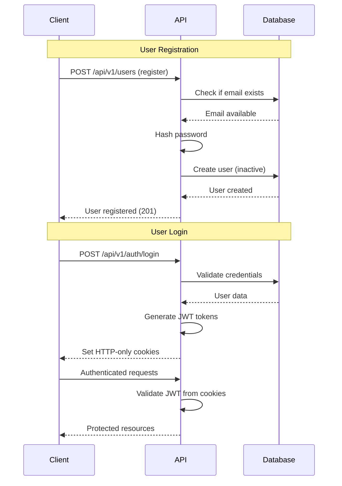

# SampleProject API Documentation

## 📋 Table of Contents
- [Overview](#overview)
- [Authentication](#authentication)
- [Rate Limiting](#rate-limiting)
- [Monitoring & Metrics](#monitoring--metrics)
- [API Endpoints](#api-endpoints)
- [Error Handling](#error-handling)
- [RFC7807 Problem Details](#rfc7807-problem-details)
- [Examples](#examples)
- [SDK Examples](#sdk-examples)

---

## 🎯 Overview

**SampleProject API** is a .NET 9 Web API providing secure user authentication, management, and comprehensive monitoring capabilities.

### Key Features
- ✅ JWT authentication with HTTP-only cookies
- ✅ RFC7807 Problem Details for standardized error responses
- ✅ Rate limiting and security headers
- ✅ Comprehensive monitoring and metrics
- ✅ Clean Architecture with CQRS pattern

### Base URLs
- **Development**: `http://localhost:15553` (HTTP) or `https://localhost:7155` (HTTPS)
- **Production**: `https://yourdomain.com`

### Content Type
All requests and responses use `application/json` content type.

### Authentication
The API uses JWT tokens stored in HTTP-only cookies for security.

### Error Handling
The API implements RFC7807 Problem Details for HTTP APIs, providing standardized and detailed error responses.

---

## 🔐 Authentication

### Authentication Flow



### Token Configuration
- **Access Token**: 60 minutes expiration
- **Refresh Token**: 7 days expiration
- **Storage**: HTTP-only cookies (`auth_session`, `auth_refresh`)
- **Security**: Secure flag, SameSite=Strict

### User Registration
New users can register by providing email, password, and personal information. After registration, users are created with `IsActive = false` and `IsEmailVerified = false` (email verification will be implemented in the future).

---

## 🚦 Rate Limiting

### Rate Limits
- **Global**: 1000 requests per minute
- **Per IP**: 100 requests per minute
- **Authentication**: 10 requests per minute
- **Refresh Token**: 5 requests per minute

### Rate Limit Headers
```
X-RateLimit-Limit-Global: 1000
X-RateLimit-Remaining-Global: 999
X-RateLimit-Limit-IP: 100
X-RateLimit-Remaining-IP: 99
X-RateLimit-Reset: Mon, 27 Jan 2025 15:30:00 GMT
```

### Rate Limit Response
```json
{
  "success": false,
  "message": "Rate limit exceeded. Please try again later.",
  "retryAfter": 60
}
```

---

## 📊 Monitoring & Metrics

### Correlation ID
All requests include a correlation ID for tracking:
- **Header**: `X-Correlation-ID`
- **Format**: 8-character alphanumeric string
- **Purpose**: Request tracing and debugging

### Available Metrics
- **HTTP Requests**: Count, duration, status codes
- **Authentication Events**: Login, logout, refresh attempts
- **Business Events**: User creation, updates, deletions
- **System Metrics**: Memory usage, CPU usage, GC collections
- **Database Queries**: Query duration, success/failure rates

### Metrics Endpoint
- **URL**: `/metrics`
- **Format**: Prometheus format
- **Authentication**: Not required

---

## 🛣️ API Endpoints

### Authentication Endpoints

#### POST /api/v1/auth/login
Authenticate user and receive JWT tokens.

**Request:**
```json
{
  "email": "user@example.com",
  "password": "password123"
}
```

**Response:**
```json
{
  "success": true,
  "message": "Login successful",
  "user": {
    "email": "user@example.com",
    "expiresAt": "2025-01-27T15:30:00Z"
  }
}
```

**Cookies Set:**
- `auth_session`: JWT access token
- `auth_refresh`: Refresh token

**Rate Limit:** 10 requests/minute

---

#### POST /api/v1/auth/logout
Logout user and revoke tokens.

**Request:** None (uses cookies)

**Response:**
```json
{
  "success": true,
  "message": "Logout successful"
}
```

**Actions:**
- Clears authentication cookies
- Revokes refresh token in database

---

#### POST /api/v1/auth/refresh
Refresh access token using refresh token from HTTP-only cookies.

**Request:**
No body required - refresh token is automatically extracted from `auth_refresh` cookie.

**Response:**
```json
{
  "success": true,
  "message": "Token refreshed successfully",
  "expiresAt": "2025-01-27T16:30:00Z"
}
```

**Cookies Updated:**
- `auth_session`: New JWT access token
- `auth_refresh`: New refresh token

**Rate Limit:** 5 requests/minute

**Note:** This endpoint enables stateless refresh authentication via HTTP-only cookies, eliminating the need for clients to manage refresh tokens manually.

---

#### GET /api/v1/auth/me
Get current authenticated user information.

**Request:** None (uses cookies)

**Response:**
```json
{
  "success": true,
  "user": {
    "userId": "550e8400-e29b-41d4-a716-446655440000",
    "email": "user@example.com",
    "firstName": "John",
    "lastName": "Doe",
    "fullName": "John Doe",
    "roles": ["User"]
  }
}
```

---

#### GET /api/v1/auth/validate
Validate current JWT token.

**Request:** None (uses cookies)

**Response:**
```json
{
  "success": true,
  "message": "Token is valid",
  "user": {
    "userId": "550e8400-e29b-41d4-a716-446655440000",
    "email": "user@example.com"
  }
}
```

---

### User Management Endpoints

#### POST /api/v1/users
Register a new user.

**Request:**
```json
{
  "email": "newuser@example.com",
  "firstName": "John",
  "lastName": "Doe",
  "password": "password123"
}
```

**Response:**
```json
{
  "success": true,
  "message": "User created successfully",
  "user": {
    "userId": "550e8400-e29b-41d4-a716-446655440001",
    "email": "newuser@example.com",
    "firstName": "Jane",
    "lastName": "Smith",
    "fullName": "Jane Smith",
    "roles": ["User"],
    "isActive": true,
    "isEmailVerified": false,
    "createdAt": "2025-01-27T14:30:00Z"
  }
}
```

---

#### GET /api/v1/users/{userId}
Get user by ID.

**Authentication:** Required (User or Admin role)

**Authorization Rules:**
- **User role**: Can only access their own data
- **Admin role**: Can access any user's data

**Request:** None (uses route parameter)

**Response:**
```json
{
  "id": "550e8400-e29b-41d4-a716-446655440000",
  "email": "user@example.com",
  "firstName": "John",
  "lastName": "Doe",
  "createdAt": "2025-01-27T14:30:00Z"
}
```

**Error Responses:**
- `401 Unauthorized` - Invalid or missing authentication token
- `403 Forbidden` - User trying to access another user's data (non-admin)
- `404 Not Found` - User not found

---

#### GET /api/v1/users
Get paginated list of users with filters (Admin only).

**Authentication:** Required (Admin role only)

**Query Parameters:**
- `page` (int, optional): Page number (default: 1)
- `pageSize` (int, optional): Page size (default: 10, max: 100)
- `searchTerm` (string, optional): Search in first name, last name, or email
- `role` (UserRole, optional): Filter by user role (User, Admin)
- `isActive` (bool, optional): Filter by active status
- `isEmailVerified` (bool, optional): Filter by email verification status
- `createdFrom` (datetime, optional): Filter by creation date from
- `createdTo` (datetime, optional): Filter by creation date to
- `sortBy` (string, optional): Sort field (FirstName, LastName, Email, CreatedAt, IsActive, IsEmailVerified)
- `sortDirection` (string, optional): Sort direction (asc/desc, default: desc)

**Response:**
```json
{
  "items": [
    {
      "id": "550e8400-e29b-41d4-a716-446655440000",
      "email": "user@example.com",
      "firstName": "John",
      "lastName": "Doe",
      "createdAt": "2025-01-27T14:30:00Z"
    }
  ],
  "page": 1,
  "pageSize": 10,
  "totalCount": 25,
  "totalPages": 3,
  "hasPreviousPage": false,
  "hasNextPage": true
}
```

**Error Responses:**
- `401 Unauthorized` - Invalid or missing authentication token
- `403 Forbidden` - Admin role required
- `400 Bad Request` - Invalid parameters

**Examples:**
- `GET /api/v1/users?page=1&pageSize=20` - First 20 users
- `GET /api/v1/users?searchTerm=john&isActive=true` - Search for "john" in active users
- `GET /api/v1/users?role=Admin&sortBy=CreatedAt&sortDirection=asc` - All admins sorted by creation date

---

#### GET /api/v1/users/check-email/{email}
Check if email is available for registration.

**Request:** None (uses route parameter)

**Response:**
```json
true
```

**Description:** Returns `true` if email is available for registration, `false` if already taken. No authentication required.

**Example:**
- `GET /api/v1/users/check-email/user@example.com` → `true` (available)
- `GET /api/v1/users/check-email/existing@example.com` → `false` (taken)

---

#### PUT /api/v1/users/me
Update current user's profile information.

**Authentication:** Required (User)

**Request:**
```json
{
  "firstName": "John",
  "lastName": "Doe",
  "email": "john.doe@example.com"
}
```

**Note:** This endpoint automatically uses the current user's ID from the JWT token. No `userId` parameter is required in the request body.

**Response:**
```json
{
  "id": "550e8400-e29b-41d4-a716-446655440000",
  "email": "john.doe@example.com",
  "firstName": "John",
  "lastName": "Doe",
  "isActive": true,
  "isEmailVerified": false,
  "createdAt": "2025-01-27T14:30:00Z",
  "updatedAt": "2025-01-27T15:30:00Z"
}
```

**Error Responses:**
- `401 Unauthorized` - Invalid or missing authentication token
- `404 Not Found` - User not found
- `400 Bad Request` - Invalid input data

---

#### PATCH /api/v1/users/me
Partial update of current user's profile (same rules as PUT).

Use when only some of the fields are being updated.

---

#### PUT /api/v1/users/{userId}
Update any user's information (Admin only).

**Authentication:** Required (Admin)

**Request:**
```json
{
  "firstName": "John",
  "lastName": "Doe",
  "email": "john.doe@example.com",
  "isActive": true,
  "isEmailVerified": true,
  "role": "Admin"
}
```

**Note:** The `userId` is provided in the URL path, not in the request body.

**Response:**
```json
{
  "id": "550e8400-e29b-41d4-a716-446655440000",
  "email": "john.doe@example.com",
  "firstName": "John",
  "lastName": "Doe",
  "isActive": true,
  "isEmailVerified": true,
  "createdAt": "2025-01-27T14:30:00Z",
  "updatedAt": "2025-01-27T15:30:00Z"
}
```

**Error Responses:**
- `401 Unauthorized` - Invalid or missing authentication token
- `403 Forbidden` - Admin role required
- `404 Not Found` - User not found
- `400 Bad Request` - Invalid input data

---

#### PATCH /api/v1/users/{userId}
Partial update of any user's information (Admin only).

Use when only some of the fields are being updated.

---

#### POST /api/v1/users/me/change-password
Change current user's password.

**Authentication:** Required (User)

**Request:**
```json
{
  "currentPassword": "oldPassword123",
  "newPassword": "newPassword456"
}
```

**Note:** This endpoint automatically uses the current user's ID from the JWT token. Uses the same request format as the admin endpoint.

**Response:**
```json
true
```

**Error Responses:**
- `401 Unauthorized` - Invalid or missing authentication token
- `404 Not Found` - User not found
- `400 Bad Request` - Invalid input data or invalid current password

---

#### POST /api/v1/users/{userId}/change-password
Change any user's password (Admin only).

**Authentication:** Required (Admin)

**Request:**
```json
{
  "currentPassword": "oldPassword123",
  "newPassword": "newPassword456"
}
```

**Note:** The `userId` is provided in the URL path, not in the request body.

**Response:**
```json
true
```

**Error Responses:**
- `401 Unauthorized` - Invalid or missing authentication token
- `403 Forbidden` - Admin role required
- `404 Not Found` - User not found
- `400 Bad Request` - Invalid input data

---

#### POST /api/v1/users/{userId}/change-role
Change user role (Admin only).

**Authentication:** Required (Admin)

**Request:**
```json
{
  "newRole": "Admin"
}
```

**Note:** The `userId` is provided in the URL path, not in the request body.

**Response:**
```json
{
  "id": "550e8400-e29b-41d4-a716-446655440000",
  "email": "user@example.com",
  "firstName": "John",
  "lastName": "Doe",
  "roles": "Admin",
  "isActive": true,
  "isEmailVerified": true,
  "createdAt": "2025-01-27T14:30:00Z",
  "updatedAt": "2025-01-27T15:30:00Z"
}
```

**Error Responses:**
- `401 Unauthorized` - Invalid or missing authentication token
- `403 Forbidden` - Admin role required
- `404 Not Found` - User not found
- `400 Bad Request` - Invalid role provided (must be valid UserRole enum value)

---

### Health & Diagnostic Endpoints

#### GET /health
Basic health check.

**Request:** None

**Response:**
```json
{
  "status": "Healthy",
  "totalDuration": "00:00:00.1234567",
  "checks": [
    {
      "name": "database",
      "status": "Healthy",
      "duration": "00:00:00.0123456",
      "description": "Database connectivity check"
    },
    {
      "name": "memory",
      "status": "Healthy",
      "duration": "00:00:00.0001234",
      "description": "Memory usage check"
    }
  ]
}
```

---

#### GET /health-ui
Health check dashboard (Development only).

**Request:** None

**Response:** HTML dashboard

---

#### GET /metrics
Prometheus metrics endpoint.

**Request:** None

**Response:** Prometheus format metrics

---

## ❌ Error Handling

### Error Response Formats

1) Global exceptions (ExceptionHandlingMiddleware):
```json
{
  "statusCode": 400,
  "message": "Validation error",
  "details": [
    { "field": "email", "error": "Email is required" }
  ]
}
```

2) Controller-level errors (e.g., UsersController):
```json
{
  "error": "Validation error",
  "errorDescription": "Invalid input data"
}
```

### HTTP Status Codes
- **200 OK**: Successful request
- **400 Bad Request**: Invalid request data
- **401 Unauthorized**: Invalid or expired token
- **403 Forbidden**: Insufficient permissions
- **404 Not Found**: Resource not found
- **429 Too Many Requests**: Rate limit exceeded
- **500 Internal Server Error**: Server error

### Common Error Messages
- `"Invalid credentials"` - Login failed
- `"Token is invalid or expired"` - JWT validation failed
- `"Rate limit exceeded. Please try again later."` - Rate limit hit
- `"User not found"` - User doesn't exist
- `"Validation failed"` - Request validation error

---

## 💡 Examples

### Complete Authentication Flow

#### 1. Login
```bash
curl -X POST http://localhost:15553/api/v1/auth/login \
  -H "Content-Type: application/json" \
  -d '{
    "email": "user@example.com",
    "password": "user"
  }'
```

#### 2. Get User Info
```bash
curl -X GET http://localhost:15553/api/v1/auth/me \
  -H "Cookie: auth_session=eyJhbGciOiJIUzI1NiIsInR5cCI6IkpXVCJ9..."
```

#### 3. Refresh Token
```bash
curl -X POST http://localhost:15553/api/v1/auth/refresh \
  -H "Content-Type: application/json" \
  -d '{
    "refreshToken": "refresh_token_here"
  }'
```

#### 4. Logout
```bash
curl -X POST http://localhost:15553/api/v1/auth/logout \
  -H "Cookie: auth_session=eyJhbGciOiJIUzI1NiIsInR5cCI6IkpXVCJ9..."
```

### Error Handling

The API implements RFC7807 Problem Details for HTTP APIs, providing standardized error responses with detailed information about what went wrong.

#### RFC7807 Problem Details Format

All error responses follow the RFC7807 standard with the following structure:

```json
{
  "type": "https://example.com/probs/validation-error",
  "title": "Validation Error",
  "status": 400,
  "detail": "The request contains invalid data",
  "instance": "/api/v1/users",
  "errors": [
    {
      "field": "email",
      "message": "Email is required"
    },
    {
      "field": "password",
      "message": "Password must be at least 8 characters"
    }
  ]
}
```

#### Error Response Fields

- **`type`**: A URI reference that identifies the problem type
- **`title`**: A short, human-readable summary of the problem type
- **`status`**: The HTTP status code
- **`detail`**: A human-readable explanation specific to this occurrence
- **`instance`**: A URI reference that identifies the specific occurrence of the problem
- **`errors`**: Array of field-specific validation errors (for validation failures)

### Error Handling Examples

#### Validation Error (400 Bad Request)
```bash
curl -X POST http://localhost:15553/api/v1/users \
  -H "Content-Type: application/json" \
  -d '{"email": "invalid-email", "password": "123"}'

# Response (400 Bad Request)
{
  "type": "https://example.com/probs/validation-error",
  "title": "Validation Error",
  "status": 400,
  "detail": "The request contains invalid data",
  "instance": "/api/v1/users",
  "errors": [
    {
      "field": "email",
      "message": "Email format is invalid"
    },
    {
      "field": "password",
      "message": "Password must be at least 8 characters"
    }
  ]
}
```

#### Authentication Error (401 Unauthorized)
```bash
curl -X GET http://localhost:15553/api/v1/auth/me \
  -H "Cookie: auth_session=invalid_token"

# Response (401 Unauthorized)
{
  "type": "https://example.com/probs/unauthorized",
  "title": "Unauthorized",
  "status": 401,
  "detail": "Token is invalid or expired",
  "instance": "/api/v1/auth/me"
}
```

#### Not Found Error (404 Not Found)
```bash
curl -X GET http://localhost:15553/api/v1/users/00000000-0000-0000-0000-000000000000

# Response (404 Not Found)
{
  "type": "https://example.com/probs/not-found",
  "title": "Not Found",
  "status": 404,
  "detail": "User with the specified ID was not found",
  "instance": "/api/v1/users/00000000-0000-0000-0000-000000000000"
}
```

#### Rate Limit Exceeded (429 Too Many Requests)
```bash
curl -X POST http://localhost:15553/api/v1/auth/login \
  -H "Content-Type: application/json" \
  -d '{"email": "user@example.com", "password": "user"}'

# Response (429 Too Many Requests)
{
  "type": "https://example.com/probs/rate-limit-exceeded",
  "title": "Rate Limit Exceeded",
  "status": 429,
  "detail": "Too many requests. Please try again later.",
  "instance": "/api/v1/auth/login",
  "retryAfter": 60
}
```

#### Internal Server Error (500 Internal Server Error)
```bash
# Response (500 Internal Server Error)
{
  "type": "https://example.com/probs/internal-server-error",
  "title": "Internal Server Error",
  "status": 500,
  "detail": "An unexpected error occurred while processing your request",
  "instance": "/api/v1/users"
}
```

---

## 🔧 SDK Examples

### JavaScript/TypeScript

```typescript
class SampleProjectAPI {
  private baseUrl: string;
  
  constructor(baseUrl: string = 'http://localhost:15553') {
    this.baseUrl = baseUrl;
  }

  async login(email: string, password: string) {
    const response = await fetch(`${this.baseUrl}/api/v1/auth/login`, {
      method: 'POST',
      headers: {
        'Content-Type': 'application/json',
      },
      credentials: 'include', // Important for cookies
      body: JSON.stringify({ email, password })
    });
    
    return response.json();
  }

  async getCurrentUser() {
    const response = await fetch(`${this.baseUrl}/api/v1/auth/me`, {
      credentials: 'include' // Important for cookies
    });
    
    return response.json();
  }

  async logout() {
    const response = await fetch(`${this.baseUrl}/api/v1/auth/logout`, {
      method: 'POST',
      credentials: 'include' // Important for cookies
    });
    
    return response.json();
  }
}

// Usage
const api = new SampleProjectAPI();
const loginResult = await api.login('user@example.com', 'user');
console.log(loginResult);

const user = await api.getCurrentUser();
console.log(user);
```

### C# .NET

```csharp
public class SampleProjectClient
{
    private readonly HttpClient _httpClient;
    private readonly string _baseUrl;

    public SampleProjectClient(string baseUrl = "http://localhost:15553")
    {
        _baseUrl = baseUrl;
        _httpClient = new HttpClient();
    }

    public async Task<LoginResponse> LoginAsync(string email, string password)
    {
        var request = new LoginRequest { Email = email, Password = password };
        var json = JsonSerializer.Serialize(request);
        var content = new StringContent(json, Encoding.UTF8, "application/json");

        var response = await _httpClient.PostAsync($"{_baseUrl}/api/v1/auth/login", content);
        var responseContent = await response.Content.ReadAsStringAsync();
        
        return JsonSerializer.Deserialize<LoginResponse>(responseContent);
    }

    public async Task<UserResponse> GetCurrentUserAsync()
    {
        var response = await _httpClient.GetAsync($"{_baseUrl}/api/v1/auth/me");
        var responseContent = await response.Content.ReadAsStringAsync();
        
        return JsonSerializer.Deserialize<UserResponse>(responseContent);
    }

    public async Task<LogoutResponse> LogoutAsync()
    {
        var response = await _httpClient.PostAsync($"{_baseUrl}/api/v1/auth/logout", null);
        var responseContent = await response.Content.ReadAsStringAsync();
        
        return JsonSerializer.Deserialize<LogoutResponse>(responseContent);
    }
}

// Usage
var client = new SampleProjectClient();
var loginResult = await client.LoginAsync("user@example.com", "user");
Console.WriteLine(loginResult.Message);

var user = await client.GetCurrentUserAsync();
Console.WriteLine($"User: {user.User.FullName}");
```

### Python

```python
import requests
import json

class SampleProjectAPI:
    def __init__(self, base_url="http://localhost:15553"):
        self.base_url = base_url
        self.session = requests.Session()

    def login(self, email, password):
        response = self.session.post(
            f"{self.base_url}/api/v1/auth/login",
            json={"email": email, "password": password}
        )
        return response.json()

    def get_current_user(self):
        response = self.session.get(f"{self.base_url}/api/v1/auth/me")
        return response.json()

    def logout(self):
        response = self.session.post(f"{self.base_url}/api/v1/auth/logout")
        return response.json()

# Usage
api = SampleProjectAPI()
login_result = api.login("user@example.com", "user")
print(login_result)

user = api.get_current_user()
print(f"User: {user['user']['fullName']}")
```

---

## 🔒 Security Considerations

### Best Practices
1. **Always use HTTPS in production**
2. **Store tokens in HTTP-only cookies** (handled automatically)
3. **Implement proper error handling**
4. **Respect rate limits**
5. **Use correlation IDs for debugging**
6. **Monitor metrics and logs**

### Demo Credentials
- **Admin**: `admin@example.com` / `admin`
- **User**: `user@example.com` / `user`
- **Swagger Auth**: `swagger` / `swagger123`

---

## 🗄️ Database Audit Logging

### Enhanced Audit Logging Script

The application includes comprehensive audit logging for user changes. The enhanced SQL script automatically tracks all changes to the `Users` table and stores them in `UserAuditLogs`.

#### Key Features
- **Comprehensive Field Tracking**: Monitors all UserEntity properties including:
  - Basic info: Email, FirstName, LastName, Roles
  - Status: IsActive, IsEmailVerified, LastLoginAt
  - Security: RefreshToken, RefreshTokenExpiryTime, RefreshTokenUseCount, RefreshTokenLastUsedAt
  - Timestamps: CreatedAt, UpdatedAt

- **Smart Change Detection**: Only logs when fields actually change
- **JSON-based Storage**: Old and new values stored as structured JSON
- **Helper Functions**: Built-in functions for querying audit history
- **Performance Optimized**: Proper indexes for fast queries

#### Installation
```sql
-- Run the enhanced audit logging script
\i SampleProject.Persistence/Migrations/audit_log_trigger_enhanced.sql
```

#### Query Examples

**Get user audit history:**
```sql
SELECT * FROM get_user_audit_history('user-uuid-here', 10);
```

**Get audit statistics:**
```sql
SELECT * FROM get_audit_statistics();
```

**Manual audit log query:**
```sql
SELECT 
    "Action",
    "CreatedAt",
    "Notes",
    "OldValue"::JSONB as old_values,
    "NewValue"::JSONB as new_values
FROM "UserAuditLogs" 
WHERE "UserId" = 'user-uuid-here'
ORDER BY "CreatedAt" DESC;
```

#### Audit Log Structure
```json
{
  "ChangedFields": ["FirstName", "IsActive"],
  "OldValues": {
    "Email": "user@example.com",
    "FirstName": "John",
    "LastName": "Doe",
    "Roles": "User",
    "IsActive": true,
    "IsEmailVerified": false
  },
  "NewValues": {
    "Email": "user@example.com", 
    "FirstName": "Jane",
    "LastName": "Doe",
    "Roles": "User",
    "IsActive": false,
    "IsEmailVerified": false
  }
}
```

---

## 📚 Additional Resources

- [Swagger UI](http://localhost:15553/swagger) - Interactive API documentation
- [Health Dashboard](http://localhost:15553/health-ui) - System health monitoring
- [Metrics](http://localhost:15553/metrics) - Prometheus metrics
- [Architecture Analysis](ARCHITECTURE_ANALYSIS.md) - Detailed architecture overview
- [Comprehensive Functionality Analysis](COMPREHENSIVE_FUNCTIONALITY_ANALYSIS.md) - Complete feature analysis

---

**SampleProject API** - Secure, Scalable, and Well-Monitored .NET 9 Web API
