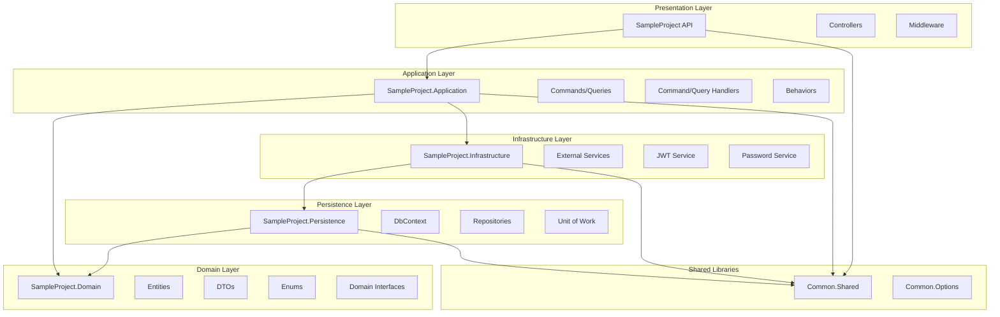
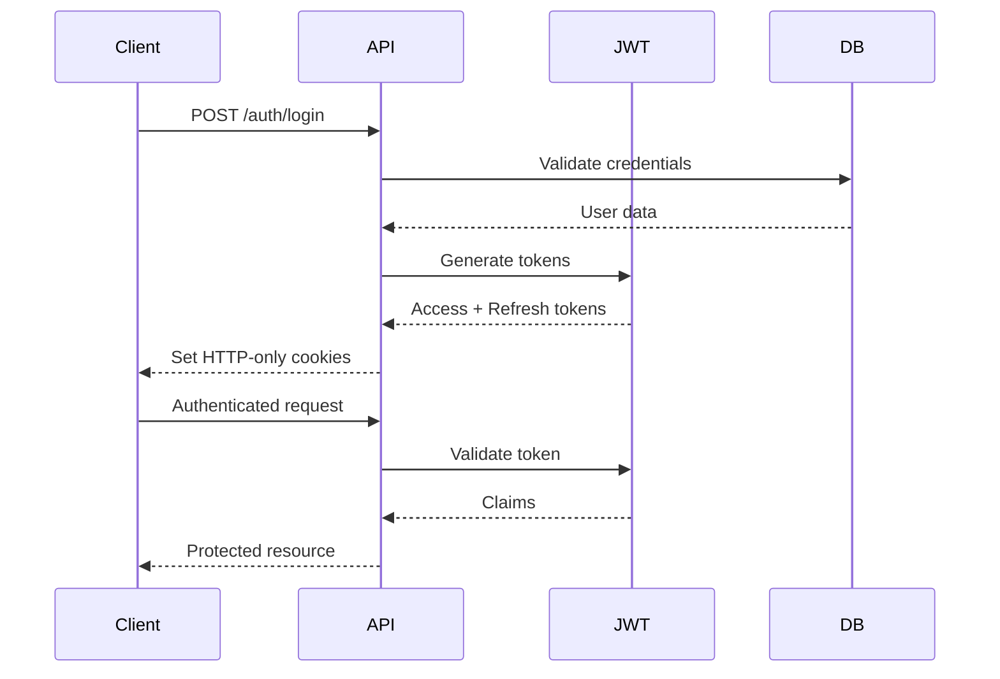
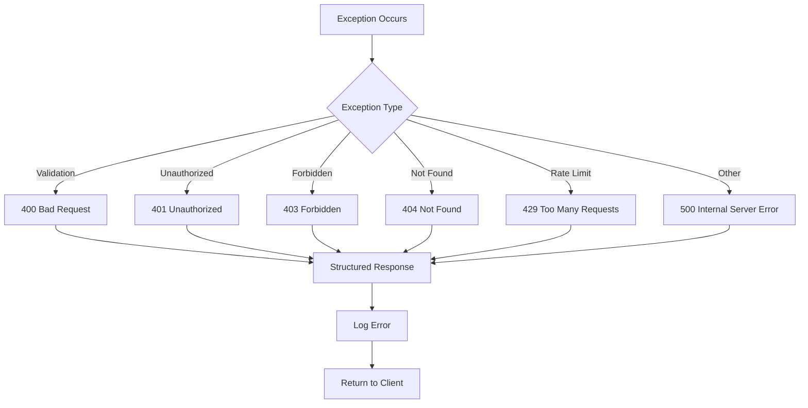

# Architecture Analysis - SampleProject

## 📋 Table of Contents
- [Overview](#overview)
- [Clean Architecture Layers](#clean-architecture-layers)
- [Technology Stack](#technology-stack)
- [Project Structure](#project-structure)
- [Dependency Flow](#dependency-flow)
- [Design Patterns](#design-patterns)
- [Configuration Management](#configuration-management)
- [Middleware Pipeline](#middleware-pipeline)
- [Service Registration](#service-registration)
- [Database Architecture](#database-architecture)
- [Security Architecture](#security-architecture)
- [Logging Architecture](#logging-architecture)
- [Monitoring & Metrics](#monitoring--metrics)
- [Testing Strategy](#testing-strategy)
- [Deployment Architecture](#deployment-architecture)

---

## 🎯 Overview

**SampleProject** implements Clean Architecture principles with a .NET 9 Web API, providing a scalable, maintainable, and testable codebase. The architecture follows the Dependency Inversion Principle, ensuring that high-level modules don't depend on low-level modules.

### Key Architectural Principles
- **Separation of Concerns**: Each layer has a single responsibility
- **Dependency Inversion**: High-level modules depend on abstractions
- **Single Responsibility**: Each class has one reason to change
- **Open/Closed Principle**: Open for extension, closed for modification
- **Interface Segregation**: Clients depend only on interfaces they use

---

## 🏗️ Clean Architecture Layers

### Layer Overview



### Layer Responsibilities

#### 1. **Presentation Layer** (`SampleProject`)
- **Purpose**: Handles HTTP requests and responses
- **Components**: Controllers, Middleware, Program.cs
- **Responsibilities**:
  - Request/response handling
  - Authentication/authorization
  - Input validation
  - Error handling
  - CORS configuration
  - Security headers

#### 2. **Application Layer** (`SampleProject.Application`)
- **Purpose**: Contains business logic and use cases
- **Components**: Commands, Queries, Handlers, Behaviors
- **Responsibilities**:
  - Business logic implementation
  - Use case orchestration
  - Input validation (FluentValidation)
  - Command/Query handling (MediatR)
  - Cross-cutting concerns (logging, caching)

#### 3. **Domain Layer** (`SampleProject.Domain`)
- **Purpose**: Contains core business entities and rules
- **Components**: Entities, DTOs, Enums, Domain Interfaces
- **Responsibilities**:
  - Business entities
  - Domain rules and validation
  - Domain interfaces
  - Value objects
  - Domain events

#### 4. **Infrastructure Layer** (`SampleProject.Infrastructure`)
- **Purpose**: Implements external concerns and services
- **Components**: JWT Service, Password Service, Cache Service
- **Responsibilities**:
  - External service implementations
  - JWT token management
  - Password hashing
  - Caching
  - Email services
  - Third-party integrations

#### 5. **Persistence Layer** (`SampleProject.Persistence`)
- **Purpose**: Handles data access and storage
- **Components**: DbContext, Repositories, Unit of Work
- **Responsibilities**:
  - Database operations
  - Entity Framework configuration
  - Repository pattern implementation
  - Transaction management
  - Database migrations

---

## 🛠️ Technology Stack

### Core Technologies
- **.NET 9**: Latest .NET framework
- **ASP.NET Core**: Web API framework
- **Entity Framework Core 9**: ORM
- **PostgreSQL**: Primary database
- **MediatR**: CQRS implementation
- **AutoMapper**: Object mapping
- **FluentValidation**: Input validation

### Authentication & Security
- **JWT**: Token-based authentication
- **HTTP-only Cookies**: Secure token storage
- **BCrypt**: Password hashing
- **Rate Limiting**: Request throttling
- **Security Headers**: XSS, CSRF protection

### Logging & Monitoring
- **Serilog**: Structured logging
- **Prometheus**: Metrics collection
- **Health Checks**: System monitoring
- **Correlation ID**: Request tracking

### Development Tools
- **Swagger/OpenAPI**: API documentation
- **xUnit**: Unit testing
- **FluentAssertions**: Test assertions
- **Moq**: Mocking framework
- **Docker**: Containerization

---

## 📁 Project Structure

### Solution Structure
```
SampleProject.sln
├── SampleProject/                    # Presentation Layer
│   ├── Controllers/
│   │   ├── Auth/
│   │   ├── Users/
│   │   └── Diagnostic/
│   ├── Middleware/
│   ├── Installers/
│   └── Program.cs
├── SampleProject.Application/        # Application Layer
│   ├── Features/
│   │   ├── Auth/
│   │   └── Users/
│   ├── Behaviors/
│   ├── Implementations/
│   └── Interfaces/
├── SampleProject.Domain/             # Domain Layer
│   ├── Entities/
│   ├── Dto/
│   ├── Enums/
│   └── Responses/
├── SampleProject.Infrastructure/     # Infrastructure Layer
│   ├── Implementations/
│   ├── Interfaces/
│   └── Services/
├── SampleProject.Persistence/        # Persistence Layer
│   ├── Data/
│   ├── Repositories/
│   ├── UnitOfWork/
│   └── Migrations/
├── SampleProject.Test/               # Test Layer
│   ├── Unit/
│   └── Integration/
├── Common.Shared/                    # Shared Library
└── Common.Options/                   # Configuration Library
```

### Key Files and Their Purpose

#### **Program.cs**
- Application entry point
- Service configuration
- Middleware pipeline setup
- Startup information display

#### **Controllers**
- **AuthController**: Authentication endpoints
- **UsersController**: User management endpoints
- **DiagnosticController**: Health checks and metrics

#### **Middleware**
- **JwtTokenMiddleware**: JWT token extraction and validation
- **ExceptionHandlingMiddleware**: Global exception handling
- **RequestLoggingMiddleware**: Request/response logging
- **RateLimitingMiddleware**: Request rate limiting
- **SecurityHeadersMiddleware**: Security headers injection

#### **Features (CQRS)**
- **Commands**: Write operations (Create, Update, Delete)
- **Queries**: Read operations (Get, List, Search)
- **Handlers**: Business logic implementation
- **Validators**: Input validation rules

---

## 🔄 Dependency Flow

### Dependency Rules
1. **Presentation** → **Application** → **Domain**
2. **Infrastructure** → **Domain** (implements domain interfaces)
3. **Persistence** → **Domain** (implements domain interfaces)
4. **Application** → **Infrastructure** (uses infrastructure services)
5. **Presentation** → **Infrastructure** (uses infrastructure services)

### Dependency Injection Container
```csharp
// Service registration order
1. LoggingInstaller (Order: 6)
2. DatabaseInstaller (Order: 7)
3. JwtInstaller (Order: 8)
4. HealthCheckInstaller (Order: 8)
5. SwaggerInstaller (Order: 9)
6. PrometheusInstaller (Order: 10)
```

### Interface Segregation
- **IUserService**: User business operations
- **IJwtService**: JWT token operations
- **IPasswordService**: Password hashing operations
- **ICacheService**: Caching operations
- **IUnitOfWork**: Transaction management

---

## 🎨 Design Patterns

### 1. **CQRS (Command Query Responsibility Segregation)**
```csharp
// Commands (Write operations)
public class CreateUserCommand : IRequest<Result<UserResponse>>
{
    public string Email { get; set; }
    public string FirstName { get; set; }
    public string LastName { get; set; }
    public string Password { get; set; }
}

// Queries (Read operations)
public class GetUserByIdQuery : IRequest<Result<UserResponse>>
{
    public Guid UserId { get; set; }
}
```

### 2. **Repository Pattern**
```csharp
public interface IUserRepository
{
    Task<UserEntity?> GetByIdAsync(Guid id);
    Task<UserEntity?> GetByEmailAsync(string email);
    Task<Result<UserEntity>> CreateAsync(UserEntity user);
    Task<Result<UserEntity>> UpdateAsync(UserEntity user);
    Task<Result<bool>> DeleteAsync(Guid id);
}
```

### 3. **Unit of Work Pattern**
```csharp
public interface IUnitOfWork : IDisposable
{
    IUserRepository Users { get; }
    Task<int> SaveChangesAsync();
    Task<IDbContextTransaction> BeginTransactionAsync();
}
```

### 4. **Mediator Pattern (MediatR)**
```csharp
// Decouples controllers from business logic
public class UsersController : BaseController
{
    private readonly IMediator _mediator;
    
    public async Task<IActionResult> CreateUser(CreateUserCommand command)
    {
        var result = await _mediator.Send(command);
        return HandleResult(result);
    }
}
```

### 5. **Strategy Pattern**
```csharp
// Different password hashing strategies
public interface IPasswordService
{
    string HashPassword(string password);
    bool VerifyPassword(string password, string hash);
}
```

### 6. **Factory Pattern**
```csharp
// Service factory for different implementations
public class ServiceFactory
{
    public static IJwtService CreateJwtService(IOptions<JwtOptions> options)
    {
        return new JwtService(options);
    }
}
```

---

## ⚙️ Configuration Management

### Configuration Hierarchy
1. **appsettings.json** (Base configuration)
2. **appsettings.{Environment}.json** (Environment-specific)
3. **Environment variables** (Override for production)
4. **Command line arguments** (Runtime overrides)

### Configuration Classes
```csharp
// Strongly-typed configuration
public class JwtOptions
{
    public string SecretKey { get; set; }
    public string Issuer { get; set; }
    public string Audience { get; set; }
    public int ExpirationMinutes { get; set; }
    public bool UseCookies { get; set; }
}
```

### Environment-Specific Settings
- **Development**: Detailed logging, Swagger enabled
- **Production**: Error-level logging, Swagger disabled
- **Testing**: In-memory database, mock services

---

## 🔧 Middleware Pipeline

### Pipeline Order (Critical)
```csharp
1. CORS                          // Cross-origin requests
2. SecurityHeadersMiddleware     // Security headers
3. HTTPS Redirection            // Force HTTPS (Production)
4. RequestLoggingMiddleware      // Request/response logging
5. MetricsMiddleware             // Prometheus metrics
6. CorrelationIdMiddleware       // Request correlation
7. RateLimitingMiddleware        // Rate limiting
8. Routing                       // Endpoint routing
9. JwtTokenMiddleware           // JWT extraction
10. Authentication              // JWT validation
11. Authorization               // Permission checks
12. Controllers                 // API endpoints
13. ExceptionHandlingMiddleware  // Global exception handling
```

### Middleware Responsibilities

#### **JwtTokenMiddleware**
- Extracts JWT from cookies or Authorization header
- Validates token and sets HttpContext.User
- Handles anonymous endpoints

#### **ExceptionHandlingMiddleware**
- Catches all unhandled exceptions
- Maps exceptions to HTTP status codes
- Returns consistent error responses
- Logs errors with context

#### **RequestLoggingMiddleware**
- Logs all HTTP requests and responses
- Includes timing, headers, and body
- Uses structured logging (Serilog)

---

## 🏭 Service Registration

### Installer Pattern
```csharp
public interface IInstaller
{
    void InstallServices(IServiceCollection services, IConfiguration configuration);
    int Order { get; }
}
```

### Service Categories

#### **Application Services**
- MediatR (CQRS)
- AutoMapper (Object mapping)
- FluentValidation (Input validation)

#### **Infrastructure Services**
- JWT Service
- Password Service
- Cache Service
- Email Service

#### **Persistence Services**
- Entity Framework
- Repository implementations
- Unit of Work

#### **External Services**
- Database connections
- Third-party APIs
- File storage

---

## 🗄️ Database Architecture

### Entity Framework Core
- **Code First**: Database schema from C# entities
- **Migrations**: Version-controlled schema changes
- **Connection Resilience**: Automatic retry policies
- **Query Optimization**: Compiled queries, async operations

### Database Design
```sql
-- Users table
CREATE TABLE "Users" (
    "Id" UUID PRIMARY KEY,
    "Email" VARCHAR(255) UNIQUE NOT NULL,
    "FirstName" VARCHAR(100) NOT NULL,
    "LastName" VARCHAR(100) NOT NULL,
    "PasswordHash" VARCHAR(255) NOT NULL,
    "PasswordSalt" VARCHAR(255) NOT NULL,
    "Role" INTEGER NOT NULL,
    "IsActive" BOOLEAN NOT NULL DEFAULT true,
    "IsEmailVerified" BOOLEAN NOT NULL DEFAULT false,
    "CreatedAt" TIMESTAMP NOT NULL DEFAULT NOW(),
    "LastLoginAt" TIMESTAMP,
    "RefreshToken" VARCHAR(500),
    "RefreshTokenExpiryTime" TIMESTAMP,
    "RefreshTokenUseCount" INTEGER NOT NULL DEFAULT 0,
    "RefreshTokenLastUsedAt" TIMESTAMP
);

-- Audit logs table
CREATE TABLE "UserAuditLogs" (
    "Id" UUID PRIMARY KEY,
    "UserId" UUID NOT NULL,
    "Action" VARCHAR(50) NOT NULL,
    "FieldName" VARCHAR(100),
    "OldValue" TEXT,
    "NewValue" TEXT,
    "ChangedByUserId" UUID,
    "IpAddress" VARCHAR(45),
    "UserAgent" VARCHAR(500),
    "CreatedAt" TIMESTAMP NOT NULL DEFAULT NOW(),
    "Notes" VARCHAR(1000)
);
```

### Audit Logging
- **Database Triggers**: Automatic change tracking
- **Comprehensive Tracking**: All user field changes
- **JSON Storage**: Old/new values as JSON
- **Performance Optimized**: Indexed for fast queries

---

## 🔐 Security Architecture

### Authentication Flow


### Security Features
- **JWT Tokens**: Stateless authentication
- **HTTP-only Cookies**: XSS protection
- **Secure Flag**: HTTPS-only cookies
- **SameSite=Strict**: CSRF protection
- **Rate Limiting**: Brute force protection
- **Password Hashing**: BCrypt with salt
- **Security Headers**: XSS, CSRF, clickjacking protection

### Token Management
- **Access Token**: 60 minutes (short-lived)
- **Refresh Token**: 7 days (long-lived)
- **Database Storage**: Refresh token validation
- **Automatic Rotation**: New refresh token on use

---

## 📊 Logging Architecture

### Serilog Configuration
```csharp
// Structured logging with multiple sinks
Log.Logger = new LoggerConfiguration()
    .ReadFrom.Configuration(configuration)
    .Enrich.FromLogContext()
    .Enrich.WithEnvironmentName()
    .WriteTo.Console()
    .WriteTo.File("Logs/application-.log", rollingInterval: RollingInterval.Day)
    .CreateLogger();
```

### Log Categories
- **Application**: General application flow
- **Request/Response**: HTTP request details
- **Authentication**: Login/logout events
- **Database**: Query execution and errors
- **Performance**: Timing and metrics

### Log Levels
- **Information**: Normal operations
- **Warning**: Recoverable issues
- **Error**: Application errors
- **Fatal**: Critical system failures

---

## 📈 Monitoring & Metrics

### Prometheus Metrics
- **HTTP Requests**: Count, duration, status codes
- **Authentication**: Login attempts, failures
- **Database**: Query duration, connection pool
- **System**: Memory, CPU, GC collections

### Health Checks
- **Database**: Connection and query health
- **Memory**: Available memory check
- **Custom**: Application-specific checks

### Correlation ID
- **Request Tracking**: Unique ID per request
- **Distributed Tracing**: Cross-service correlation
- **Debugging**: Easy issue identification

---

## 🧪 Testing Strategy

### Test Categories
- **Unit Tests**: Individual component testing
- **Integration Tests**: Component interaction testing
- **End-to-End Tests**: Full workflow testing

### Test Tools
- **xUnit**: Testing framework
- **FluentAssertions**: Readable assertions
- **Moq**: Mocking framework
- **TestServer**: In-memory API testing

### Test Structure
```
SampleProject.Test/
├── Unit/
│   ├── Controllers/
│   ├── Services/
│   └── Middleware/
└── Integration/
    ├── AuthFlowTests/
    └── UserManagementTests/
```

---

## 🚀 Deployment Architecture

### Docker Configuration
```dockerfile
# Multi-stage build
FROM mcr.microsoft.com/dotnet/sdk:9.0 AS build
# Build application
FROM mcr.microsoft.com/dotnet/aspnet:9.0 AS runtime
# Run application
```

### Environment Configuration
- **Development**: Local development with hot reload
- **Staging**: Pre-production testing
- **Production**: Live environment with monitoring

### Infrastructure Requirements
- **.NET 9 Runtime**: Application hosting
- **PostgreSQL 12+**: Database server
- **Reverse Proxy**: Nginx or similar
- **SSL Certificate**: HTTPS termination
- **Monitoring**: Prometheus + Grafana

---

## 🔄 Data Flow

### Request Processing Flow


### Error Handling Flow


---

## 📚 Best Practices

### Code Organization
- **Single Responsibility**: Each class has one purpose
- **Interface Segregation**: Small, focused interfaces
- **Dependency Injection**: Constructor injection
- **Async/Await**: Non-blocking operations
- **Error Handling**: Consistent error responses

### Performance
- **Async Operations**: Non-blocking I/O
- **Connection Pooling**: Database connection reuse
- **Caching**: Frequently accessed data
- **Compiled Queries**: EF Core optimization
- **Pagination**: Large dataset handling

### Security
- **Input Validation**: All inputs validated
- **SQL Injection**: Parameterized queries
- **XSS Protection**: Input sanitization
- **CSRF Protection**: SameSite cookies
- **Rate Limiting**: Request throttling

### Maintainability
- **Clean Code**: Readable and self-documenting
- **SOLID Principles**: Object-oriented design
- **DRY Principle**: Don't repeat yourself
- **Configuration**: Externalized settings
- **Logging**: Comprehensive logging

---

## 🔮 Future Enhancements

### Planned Features
- **Email Verification**: User email confirmation
- **Password Reset**: Secure password recovery
- **Two-Factor Authentication**: Enhanced security
- **API Versioning**: Backward compatibility
- **Caching Layer**: Redis integration
- **Message Queue**: Asynchronous processing
- **Microservices**: Service decomposition

### Scalability Considerations
- **Horizontal Scaling**: Multiple instances
- **Database Sharding**: Data partitioning
- **Load Balancing**: Request distribution
- **CDN Integration**: Static content delivery
- **Container Orchestration**: Kubernetes deployment

---

**SampleProject Architecture** - Clean, Scalable, and Maintainable .NET 9 Web API
