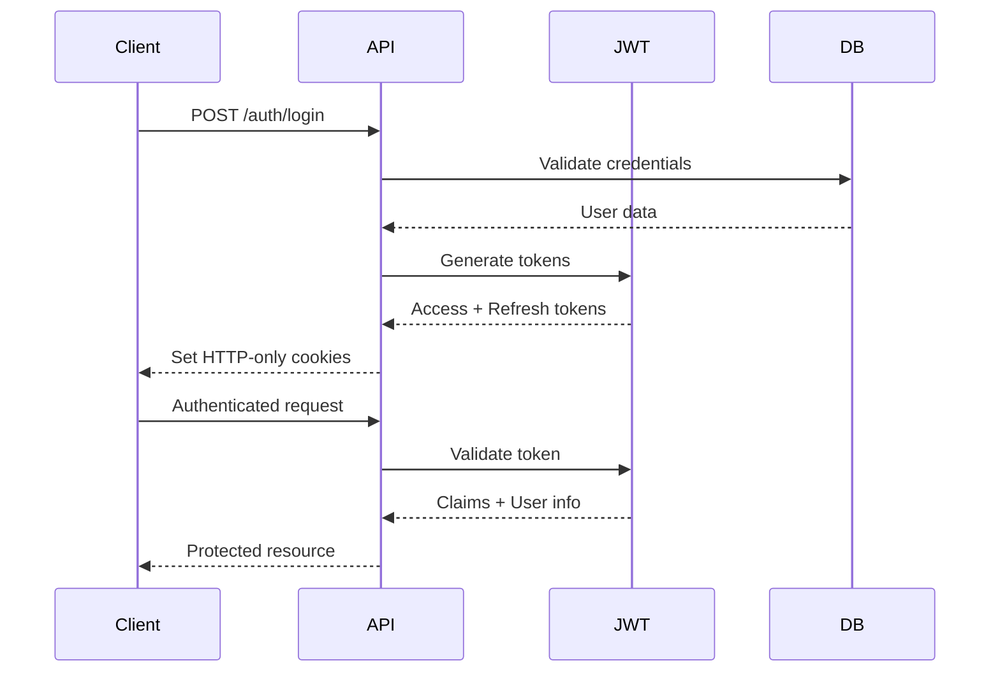

# Comprehensive Functionality Analysis - SampleProject

## 📋 Table of Contents
- [Overview](#overview)
- [Authentication & Authorization](#authentication--authorization)
- [User Management](#user-management)
- [Security Features](#security-features)
- [API Endpoints](#api-endpoints)
- [Middleware Functionality](#middleware-functionality)
- [Logging & Monitoring](#logging--monitoring)
- [Database Operations](#database-operations)
- [Error Handling](#error-handling)
- [Configuration Management](#configuration-management)
- [Testing Coverage](#testing-coverage)
- [Performance Features](#performance-features)
- [Audit & Compliance](#audit--compliance)
- [Development Tools](#development-tools)
- [Deployment Features](#deployment-features)

---

## 🎯 Overview

**SampleProject** is a comprehensive .NET 9 Web API application that provides a complete user management system with advanced security, monitoring, and audit capabilities. The application implements Clean Architecture principles and follows enterprise-grade development practices.

### Core Capabilities
- ✅ **Complete User Lifecycle Management**
- ✅ **JWT-based Authentication with HTTP-only Cookies**
- ✅ **Role-based Authorization (User/Admin)**
- ✅ **Comprehensive Audit Logging**
- ✅ **Advanced Security Features**
- ✅ **Real-time Monitoring & Metrics**
- ✅ **Rate Limiting & Request Throttling**
- ✅ **Structured Logging with Correlation ID**
- ✅ **Health Checks & Diagnostics**
- ✅ **API Documentation with Swagger**
- ✅ **Database Migration Management**
- ✅ **Comprehensive Test Coverage**

---

## 🔐 Authentication & Authorization

### Authentication System

#### **JWT Token Management**
- **Access Token**: Short-lived (60 minutes) for API access
- **Refresh Token**: Long-lived (7 days) for token renewal
- **Storage**: HTTP-only cookies for XSS protection
- **Security**: Secure flag, SameSite=Strict, domain-specific

#### **Authentication Flow**


#### **Token Features**
- **Automatic Refresh**: Seamless token renewal
- **Database Validation**: Refresh token stored in database
- **Use Tracking**: Refresh token usage count and last used timestamp
- **Revocation**: Complete token invalidation on logout
- **Multiple Sources**: Supports both cookies and Authorization header

### Authorization System

#### **Role-Based Access Control (RBAC)**
- **User Role**: Standard user permissions
- **Admin Role**: Full system access
- **Endpoint Protection**: Controller-level authorization
- **Resource-Level Security**: Users can only access their own data

#### **Authorization Rules**
```csharp
// User can only access their own data
[Authorize]
public async Task<IActionResult> GetUser(Guid userId)
{
    if (userId != _currentUser.UserId && !_currentUser.IsAdmin)
        return Forbid();
    // ... implementation
}

// Admin-only endpoints
[Authorize(Roles = "Admin")]
public async Task<IActionResult> GetAllUsers()
{
    // ... implementation
}
```

---

## 👥 User Management

### User Lifecycle Operations

#### **User Registration**
- **Email Validation**: Unique email requirement
- **Password Security**: BCrypt hashing with salt
- **Data Validation**: FluentValidation rules
- **Default State**: Inactive until email verification
- **Audit Logging**: Automatic creation tracking

#### **User Profile Management**
- **Personal Information**: First name, last name, email
- **Password Management**: Secure password changes
- **Account Status**: Active/inactive management
- **Email Verification**: Future email confirmation feature
- **Role Management**: Admin-controlled role changes

#### **User Search & Filtering**
- **Pagination**: Configurable page size (max 100)
- **Search**: Full-text search across name and email
- **Filtering**: Role, status, verification filters
- **Sorting**: Multiple field sorting options
- **Date Range**: Creation date filtering

### User Data Model
```csharp
public class UserEntity
{
    public Guid Id { get; set; }
    public string Email { get; set; }
    public string FirstName { get; set; }
    public string LastName { get; set; }
    public string PasswordHash { get; set; }
    public string PasswordSalt { get; set; }
    public UserRole Role { get; set; }
    public bool IsActive { get; set; }
    public bool IsEmailVerified { get; set; }
    public DateTime CreatedAt { get; set; }
    public DateTime? LastLoginAt { get; set; }
    public string? RefreshToken { get; set; }
    public DateTime? RefreshTokenExpiryTime { get; set; }
    public int RefreshTokenUseCount { get; set; }
    public DateTime? RefreshTokenLastUsedAt { get; set; }
}
```

---

## 🛡️ Security Features

### Password Security
- **BCrypt Hashing**: Industry-standard password hashing
- **Salt Generation**: Unique salt per password
- **Strength Validation**: Password complexity requirements
- **Secure Storage**: Never store plain text passwords

### Rate Limiting
- **Global Limits**: 1000 requests per minute
- **Per-IP Limits**: 100 requests per minute
- **Authentication Limits**: 10 login attempts per minute
- **Refresh Limits**: 5 refresh attempts per minute
- **Configurable**: Environment-specific limits

### Security Headers
- **X-Content-Type-Options**: Prevents MIME sniffing
- **X-Frame-Options**: Prevents clickjacking
- **X-XSS-Protection**: XSS attack prevention
- **Strict-Transport-Security**: HTTPS enforcement
- **Referrer-Policy**: Referrer information control

### CORS Configuration
- **Origin Control**: Configurable allowed origins
- **Method Control**: Allowed HTTP methods
- **Header Control**: Allowed request headers
- **Credential Support**: Cookie and authentication support

---

## 🛣️ API Endpoints

### Authentication Endpoints

#### **POST /api/v1/auth/login**
- **Purpose**: User authentication
- **Input**: Email and password
- **Output**: User information and token expiration
- **Cookies**: Sets auth_session and auth_refresh
- **Rate Limit**: 10 requests/minute

#### **POST /api/v1/auth/logout**
- **Purpose**: User logout and token revocation
- **Input**: None (uses cookies)
- **Output**: Success confirmation
- **Actions**: Clears cookies and revokes refresh token

#### **POST /api/v1/auth/refresh**
- **Purpose**: Access token renewal
- **Input**: Refresh token
- **Output**: New access token and expiration
- **Rate Limit**: 5 requests/minute

#### **GET /api/v1/auth/me**
- **Purpose**: Get current user information
- **Input**: None (uses cookies)
- **Output**: Complete user profile
- **Authorization**: Required

#### **GET /api/v1/auth/validate**
- **Purpose**: Token validation
- **Input**: None (uses cookies)
- **Output**: Token validity and user info
- **Authorization**: Required

### User Management Endpoints

#### **POST /api/v1/users**
- **Purpose**: User registration
- **Input**: User registration data
- **Output**: Created user information
- **Authorization**: None (public registration)

#### **GET /api/v1/users/{userId}**
- **Purpose**: Get user by ID
- **Input**: User ID in route
- **Output**: User information
- **Authorization**: User (own data) or Admin (any data)

#### **GET /api/v1/users**
- **Purpose**: Get paginated user list
- **Input**: Query parameters (pagination, filters, search)
- **Output**: Paginated user list
- **Authorization**: Admin only

#### **PUT /api/v1/users/me**
- **Purpose**: Update own profile
- **Input**: Updated user data
- **Output**: Updated user information
- **Authorization**: User (own data)

#### **PUT /api/v1/users/{userId}**
- **Purpose**: Update any user (Admin)
- **Input**: Updated user data
- **Output**: Updated user information
- **Authorization**: Admin only

#### **POST /api/v1/users/me/change-password**
- **Purpose**: Change own password
- **Input**: Current and new password
- **Output**: Success confirmation
- **Authorization**: User (own data)

#### **POST /api/v1/users/{userId}/change-password**
- **Purpose**: Change any user's password (Admin)
- **Input**: Current and new password
- **Output**: Success confirmation
- **Authorization**: Admin only

#### **POST /api/v1/users/{userId}/change-role**
- **Purpose**: Change user role (Admin)
- **Input**: New role
- **Output**: Updated user information
- **Authorization**: Admin only

#### **GET /api/v1/users/check-email/{email}**
- **Purpose**: Check email availability
- **Input**: Email in route
- **Output**: Boolean availability
- **Authorization**: None (public)

### Diagnostic Endpoints

#### **GET /health**
- **Purpose**: Basic health check
- **Input**: None
- **Output**: System health status
- **Authorization**: None

#### **GET /health-ui**
- **Purpose**: Health check dashboard
- **Input**: None
- **Output**: HTML dashboard
- **Authorization**: Development only

#### **GET /metrics**
- **Purpose**: Prometheus metrics
- **Input**: None
- **Output**: Prometheus format metrics
- **Authorization**: None

---

## 🔧 Middleware Functionality

### Request Processing Pipeline

#### **1. CORS Middleware**
- **Purpose**: Cross-origin request handling
- **Configuration**: Environment-specific origins
- **Features**: Credential support, method control

#### **2. Security Headers Middleware**
- **Purpose**: Security header injection
- **Headers**: X-Content-Type-Options, X-Frame-Options, etc.
- **Configuration**: Environment-specific settings

#### **3. Request Logging Middleware**
- **Purpose**: Comprehensive request/response logging
- **Features**: Timing, headers, body logging
- **Format**: Structured JSON logging

#### **4. Metrics Middleware**
- **Purpose**: Prometheus metrics collection
- **Metrics**: Request count, duration, status codes
- **Integration**: Prometheus scraping endpoint

#### **5. Correlation ID Middleware**
- **Purpose**: Request tracking and tracing
- **Format**: 8-character alphanumeric ID
- **Usage**: Debugging and distributed tracing

#### **6. Rate Limiting Middleware**
- **Purpose**: Request throttling and protection
- **Types**: Global, per-IP, per-endpoint limits
- **Response**: 429 status with retry information

#### **7. JWT Token Middleware**
- **Purpose**: Token extraction and validation
- **Sources**: Cookies (priority) and Authorization header
- **Features**: Anonymous endpoint support

#### **8. Exception Handling Middleware**
- **Purpose**: Global exception handling
- **Features**: Consistent error responses, logging
- **Mapping**: Exception types to HTTP status codes

---

## 📊 Logging & Monitoring

### Structured Logging (Serilog)

#### **Log Categories**
- **Application**: General application flow
- **Request/Response**: HTTP request details
- **Authentication**: Login/logout events
- **Database**: Query execution and errors
- **Performance**: Timing and metrics

#### **Log Levels**
- **Information**: Normal operations
- **Warning**: Recoverable issues
- **Error**: Application errors
- **Fatal**: Critical system failures

#### **Log Outputs**
- **Console**: Development debugging
- **File**: Persistent log storage
- **Structured**: JSON format for analysis

### Monitoring & Metrics

#### **Prometheus Metrics**
- **HTTP Requests**: Count, duration, status codes
- **Authentication**: Login attempts, failures
- **Database**: Query duration, connection pool
- **System**: Memory, CPU, GC collections

#### **Health Checks**
- **Database Health**: Connection and query validation
- **Memory Health**: Available memory check
- **Custom Health**: Application-specific checks

#### **Correlation ID Tracking**
- **Request Tracing**: Unique ID per request
- **Distributed Tracing**: Cross-service correlation
- **Debugging**: Easy issue identification

---

## 🗄️ Database Operations

### Entity Framework Core

#### **Database Context**
- **ApplicationDbContext**: Main database context
- **Connection Resilience**: Automatic retry policies
- **Query Optimization**: Compiled queries, async operations
- **Migration Management**: Version-controlled schema changes

#### **Repository Pattern**
- **IUserRepository**: User data operations
- **Unit of Work**: Transaction management
- **Async Operations**: Non-blocking database calls
- **Error Handling**: Database-specific exception handling

### Database Schema

#### **Users Table**
```sql
CREATE TABLE "Users" (
    "Id" UUID PRIMARY KEY,
    "Email" VARCHAR(255) UNIQUE NOT NULL,
    "FirstName" VARCHAR(100) NOT NULL,
    "LastName" VARCHAR(100) NOT NULL,
    "PasswordHash" VARCHAR(255) NOT NULL,
    "PasswordSalt" VARCHAR(255) NOT NULL,
    "Role" INTEGER NOT NULL,
    "IsActive" BOOLEAN NOT NULL DEFAULT true,
    "IsEmailVerified" BOOLEAN NOT NULL DEFAULT false,
    "CreatedAt" TIMESTAMP NOT NULL DEFAULT NOW(),
    "LastLoginAt" TIMESTAMP,
    "RefreshToken" VARCHAR(500),
    "RefreshTokenExpiryTime" TIMESTAMP,
    "RefreshTokenUseCount" INTEGER NOT NULL DEFAULT 0,
    "RefreshTokenLastUsedAt" TIMESTAMP
);
```

#### **UserAuditLogs Table**
```sql
CREATE TABLE "UserAuditLogs" (
    "Id" UUID PRIMARY KEY,
    "UserId" UUID NOT NULL,
    "Action" VARCHAR(50) NOT NULL,
    "FieldName" VARCHAR(100),
    "OldValue" TEXT,
    "NewValue" TEXT,
    "ChangedByUserId" UUID,
    "IpAddress" VARCHAR(45),
    "UserAgent" VARCHAR(500),
    "CreatedAt" TIMESTAMP NOT NULL DEFAULT NOW(),
    "Notes" VARCHAR(1000)
);
```

### Audit Logging

#### **Automatic Tracking**
- **Database Triggers**: Automatic change detection
- **Comprehensive Fields**: All user properties tracked
- **JSON Storage**: Old/new values as structured JSON
- **Performance Optimized**: Indexed for fast queries

#### **Audit Features**
- **User Creation**: Complete user data logging
- **User Updates**: Field-level change tracking
- **User Deletion**: Deletion event logging
- **Change Detection**: Only logs actual changes
- **Helper Functions**: Query utilities for audit data

---

## ❌ Error Handling

### Exception Management

#### **Global Exception Handling**
- **ExceptionHandlingMiddleware**: Catches all unhandled exceptions
- **Consistent Responses**: Standardized error format
- **Status Code Mapping**: Appropriate HTTP status codes
- **Error Logging**: Comprehensive error context

#### **Exception Types**
- **BadRequestException**: 400 Bad Request
- **UnauthorizedException**: 401 Unauthorized
- **ForbiddenException**: 403 Forbidden
- **NotFoundException**: 404 Not Found
- **ValidationException**: 400 with validation details
- **RateLimitException**: 429 Too Many Requests
- **InternalServerError**: 500 Internal Server Error

#### **Error Response Format**
```json
{
  "statusCode": 400,
  "message": "Validation error",
  "details": [
    { "field": "email", "error": "Email is required" }
  ],
  "correlationId": "abc12345"
}
```

### Validation System

#### **FluentValidation Integration**
- **Input Validation**: Request data validation
- **Business Rules**: Domain-specific validation
- **Error Messages**: User-friendly error descriptions
- **Async Validation**: Database-dependent validation

---

## ⚙️ Configuration Management

### Configuration Hierarchy
1. **appsettings.json**: Base configuration
2. **appsettings.{Environment}.json**: Environment-specific
3. **Environment Variables**: Production overrides
4. **Command Line**: Runtime overrides

### Configuration Classes
- **JwtOptions**: JWT token configuration
- **DatabaseOptions**: Database connection settings
- **LoggingOptions**: Serilog configuration
- **RateLimitingOptions**: Rate limiting settings
- **SwaggerOptions**: API documentation settings
- **HealthCheckOptions**: Health check configuration

### Environment-Specific Settings
- **Development**: Detailed logging, Swagger enabled
- **Production**: Error-level logging, Swagger disabled
- **Testing**: In-memory database, mock services

---

## 🧪 Testing Coverage

### Test Categories

#### **Unit Tests**
- **Controller Tests**: API endpoint testing
- **Service Tests**: Business logic testing
- **Middleware Tests**: Pipeline component testing
- **Repository Tests**: Data access testing

#### **Integration Tests**
- **Authentication Flow**: Complete login/logout testing
- **User Management**: CRUD operations testing
- **Database Integration**: EF Core testing
- **API Integration**: End-to-end API testing

### Test Tools
- **xUnit**: Testing framework
- **FluentAssertions**: Readable assertions
- **Moq**: Mocking framework
- **TestServer**: In-memory API testing
- **In-Memory Database**: EF Core testing

### Test Coverage Areas
- **Authentication**: Login, logout, token refresh
- **User Management**: CRUD operations, validation
- **Authorization**: Role-based access control
- **Error Handling**: Exception scenarios
- **Middleware**: Pipeline functionality
- **Database**: Repository operations

---

## ⚡ Performance Features

### Async Operations
- **Non-blocking I/O**: All database operations async
- **Controller Actions**: Async endpoint handlers
- **Service Methods**: Async business logic
- **Repository Operations**: Async data access

### Caching Strategy
- **Memory Caching**: Frequently accessed data
- **Cache Invalidation**: Automatic cache updates
- **Cache Keys**: Structured key naming
- **TTL Configuration**: Configurable expiration

### Database Optimization
- **Connection Pooling**: Efficient connection management
- **Compiled Queries**: EF Core query optimization
- **Indexing**: Database performance optimization
- **Pagination**: Large dataset handling

### Request Optimization
- **Rate Limiting**: Request throttling
- **Compression**: Response compression
- **CORS Optimization**: Efficient cross-origin handling
- **Security Headers**: Minimal overhead security

---

## 📋 Audit & Compliance

### Audit Logging System

#### **Comprehensive Tracking**
- **User Changes**: All user data modifications
- **Authentication Events**: Login/logout tracking
- **Admin Actions**: Administrative operations
- **System Events**: Application state changes

#### **Audit Data Structure**
```json
{
  "ChangedFields": ["FirstName", "IsActive"],
  "OldValues": {
    "FirstName": "John",
    "IsActive": true
  },
  "NewValues": {
    "FirstName": "Jane",
    "IsActive": false
  },
  "Action": "Updated",
  "CreatedAt": "2025-01-27T15:30:00Z",
  "Notes": "User profile updated"
}
```

#### **Query Capabilities**
- **User History**: Complete user change history
- **Change Statistics**: Audit data analytics
- **Time-based Queries**: Date range filtering
- **Field-specific Tracking**: Individual field changes

### Compliance Features
- **Data Retention**: Configurable audit log retention
- **Privacy Protection**: Sensitive data handling
- **Access Logging**: Who accessed what data
- **Change Tracking**: Complete audit trail

---

## 🛠️ Development Tools

### API Documentation
- **Swagger/OpenAPI**: Interactive API documentation
- **Demo Credentials**: Test user accounts
- **Request/Response Examples**: Complete API examples
- **Authentication Integration**: Swagger security

### Development Features
- **Hot Reload**: Development-time code changes
- **Detailed Logging**: Comprehensive debugging information
- **Health Dashboard**: System status monitoring
- **Metrics Endpoint**: Performance monitoring

### Code Quality
- **Clean Architecture**: Maintainable code structure
- **SOLID Principles**: Object-oriented design
- **Dependency Injection**: Loose coupling
- **Interface Segregation**: Focused interfaces

---

## 🚀 Deployment Features

### Docker Support
- **Multi-stage Build**: Optimized container images
- **Health Checks**: Container health monitoring
- **Environment Configuration**: Container-specific settings
- **Volume Mounting**: Log and data persistence

### Environment Configuration
- **Development**: Local development setup
- **Staging**: Pre-production testing
- **Production**: Live environment configuration
- **Docker Compose**: Multi-container orchestration

### Monitoring Integration
- **Prometheus**: Metrics collection
- **Grafana**: Metrics visualization
- **Health Checks**: System monitoring
- **Log Aggregation**: Centralized logging

---

## 📈 Scalability Features

### Horizontal Scaling
- **Stateless Design**: No server-side session storage
- **Load Balancer Ready**: Multiple instance support
- **Database Connection Pooling**: Efficient connection management
- **Caching Strategy**: Reduced database load

### Performance Monitoring
- **Request Timing**: Response time tracking
- **Database Metrics**: Query performance monitoring
- **Memory Usage**: Resource utilization tracking
- **Error Rates**: Failure rate monitoring

### Future Enhancements
- **Microservices**: Service decomposition
- **Message Queues**: Asynchronous processing
- **CDN Integration**: Static content delivery
- **Database Sharding**: Data partitioning

---

## 🔮 Advanced Features

### Security Enhancements
- **Two-Factor Authentication**: Enhanced security
- **Password Reset**: Secure password recovery
- **Email Verification**: Account confirmation
- **Session Management**: Advanced session control

### API Features
- **API Versioning**: Backward compatibility
- **Rate Limiting**: Advanced throttling
- **Request Validation**: Comprehensive input validation
- **Response Caching**: Performance optimization

### Monitoring Features
- **Distributed Tracing**: Cross-service tracking
- **Custom Metrics**: Business-specific monitoring
- **Alerting**: Automated issue detection
- **Dashboard**: Real-time system monitoring

---

**SampleProject** - A comprehensive, enterprise-grade .NET 9 Web API with complete user management, security, monitoring, and audit capabilities.
