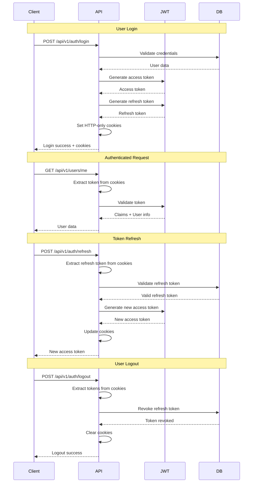

# JWT Cookies Implementation - SampleProject

## 📋 Table of Contents
- [Overview](#overview)
- [JWT Configuration](#jwt-configuration)
- [Cookie Implementation](#cookie-implementation)
- [Token Generation](#token-generation)
- [Token Validation](#token-validation)
- [Cookie Management](#cookie-management)
- [Security Features](#security-features)
- [Middleware Integration](#middleware-integration)
- [Authentication Flow](#authentication-flow)
- [Refresh Token Management](#refresh-token-management)
- [Error Handling](#error-handling)
- [Configuration Examples](#configuration-examples)
- [Troubleshooting](#troubleshooting)
- [Best Practices](#best-practices)

---

## 🎯 Overview

**SampleProject** implements JWT authentication using HTTP-only cookies for enhanced security. This approach provides protection against XSS attacks while maintaining a seamless user experience. The implementation includes access tokens, refresh tokens, and comprehensive token management.

### Key Features
- ✅ **HTTP-only Cookies**: XSS attack protection
- ✅ **Secure Flag**: HTTPS-only cookie transmission
- ✅ **SameSite=Strict**: CSRF attack protection
- ✅ **Dual Token System**: Access + Refresh tokens
- ✅ **Database Validation**: Refresh token persistence
- ✅ **Automatic Refresh**: Seamless token renewal
- ✅ **Multiple Sources**: Cookies + Authorization header support
- ✅ **Configurable Settings**: Environment-specific configuration

---

## ⚙️ JWT Configuration

### JwtOptions Configuration Class

```csharp
public class JwtOptions
{
    /// <summary>
    /// JWT secret key for token signing
    /// </summary>
    public string SecretKey { get; set; } = string.Empty;

    /// <summary>
    /// JWT issuer claim
    /// </summary>
    public string Issuer { get; set; } = string.Empty;

    /// <summary>
    /// JWT audience claim
    /// </summary>
    public string Audience { get; set; } = string.Empty;

    /// <summary>
    /// Access token expiration time in minutes
    /// </summary>
    public int ExpirationMinutes { get; set; } = 60;

    /// <summary>
    /// Refresh token expiration time in days
    /// </summary>
    public int RefreshTokenExpirationDays { get; set; } = 7;

    /// <summary>
    /// Enable JWT storage in HTTP-only cookies
    /// </summary>
    public bool UseCookies { get; set; } = true;

    /// <summary>
    /// Cookie name for access token
    /// </summary>
    public string AccessTokenCookieName { get; set; } = "auth_session";

    /// <summary>
    /// Cookie name for refresh token
    /// </summary>
    public string RefreshTokenCookieName { get; set; } = "auth_refresh";

    /// <summary>
    /// Cookie domain (null for current domain)
    /// </summary>
    public string? CookieDomain { get; set; }

    /// <summary>
    /// Cookie path
    /// </summary>
    public string CookiePath { get; set; } = "/";

    /// <summary>
    /// Enable secure flag for cookies (HTTPS only)
    /// </summary>
    public bool SecureCookies { get; set; } = true;

    /// <summary>
    /// SameSite mode for cookies
    /// </summary>
    public string SameSiteMode { get; set; } = "Strict";
}
```

### Configuration in appsettings.json

```json
{
  "Jwt": {
    "SecretKey": "your-super-secret-key-here-minimum-32-characters",
    "Issuer": "SampleProject",
    "Audience": "SampleProject.Users",
    "ExpirationMinutes": 60,
    "RefreshTokenExpirationDays": 7,
    "UseCookies": true,
    "AccessTokenCookieName": "auth_session",
    "RefreshTokenCookieName": "auth_refresh",
    "CookieDomain": null,
    "CookiePath": "/",
    "SecureCookies": true,
    "SameSiteMode": "Strict"
  }
}
```

---

## 🍪 Cookie Implementation

### Cookie Setting Implementation

```csharp
/// <summary>
/// Sets JWT tokens as HTTP-only cookies
/// </summary>
/// <param name="response">HTTP response</param>
/// <param name="accessToken">Access token</param>
/// <param name="refreshToken">Refresh token</param>
public void SetTokenCookies(HttpResponse response, string accessToken, string refreshToken)
{
    if (!_jwtOptions.UseCookies) return;

    // Set access token cookie
    var accessTokenOptions = new CookieOptions
    {
        HttpOnly = true,                    // XSS protection
        Secure = _jwtOptions.SecureCookies, // HTTPS only
        SameSite = Enum.Parse<SameSiteMode>(_jwtOptions.SameSiteMode), // CSRF protection
        Path = _jwtOptions.CookiePath,
        Expires = DateTime.UtcNow.AddMinutes(_jwtOptions.ExpirationMinutes)
    };

    if (!string.IsNullOrEmpty(_jwtOptions.CookieDomain))
    {
        accessTokenOptions.Domain = _jwtOptions.CookieDomain;
    }

    response.Cookies.Append(_jwtOptions.AccessTokenCookieName, accessToken, accessTokenOptions);

    // Set refresh token cookie
    var refreshTokenOptions = new CookieOptions
    {
        HttpOnly = true,
        Secure = _jwtOptions.SecureCookies,
        SameSite = Enum.Parse<SameSiteMode>(_jwtOptions.SameSiteMode),
        Path = _jwtOptions.CookiePath,
        Expires = DateTime.UtcNow.AddDays(_jwtOptions.RefreshTokenExpirationDays)
    };

    if (!string.IsNullOrEmpty(_jwtOptions.CookieDomain))
    {
        refreshTokenOptions.Domain = _jwtOptions.CookieDomain;
    }

    response.Cookies.Append(_jwtOptions.RefreshTokenCookieName, refreshToken, refreshTokenOptions);

    Log.Information("JWT tokens set as HTTP-only cookies");
}
```

### Cookie Retrieval Implementation

```csharp
/// <summary>
/// Gets access token from cookies
/// </summary>
/// <param name="request">HTTP request</param>
/// <returns>Access token or null if not found</returns>
public string? GetAccessTokenFromCookies(HttpRequest request)
{
    if (!_jwtOptions.UseCookies) return null;
    return request.Cookies[_jwtOptions.AccessTokenCookieName];
}

/// <summary>
/// Gets refresh token from cookies
/// </summary>
/// <param name="request">HTTP request</param>
/// <returns>Refresh token or null if not found</returns>
public string? GetRefreshTokenFromCookies(HttpRequest request)
{
    if (!_jwtOptions.UseCookies) return null;
    return request.Cookies[_jwtOptions.RefreshTokenCookieName];
}
```

### Cookie Clearing Implementation

```csharp
/// <summary>
/// Clears JWT token cookies
/// </summary>
/// <param name="response">HTTP response</param>
public void ClearTokenCookies(HttpResponse response)
{
    if (!_jwtOptions.UseCookies) return;

    var cookieOptions = new CookieOptions
    {
        HttpOnly = true,
        Secure = _jwtOptions.SecureCookies,
        SameSite = Enum.Parse<SameSiteMode>(_jwtOptions.SameSiteMode),
        Path = _jwtOptions.CookiePath,
        Expires = DateTime.UtcNow.AddDays(-1) // Expire in the past
    };

    if (!string.IsNullOrEmpty(_jwtOptions.CookieDomain))
    {
        cookieOptions.Domain = _jwtOptions.CookieDomain;
    }

    response.Cookies.Append(_jwtOptions.AccessTokenCookieName, string.Empty, cookieOptions);
    response.Cookies.Append(_jwtOptions.RefreshTokenCookieName, string.Empty, cookieOptions);

    Log.Information("JWT token cookies cleared");
}
```

---

## 🔑 Token Generation

### Access Token Generation

```csharp
/// <summary>
/// Generates JWT access token
/// </summary>
/// <param name="user">User entity</param>
/// <returns>JWT access token</returns>
public string GenerateAccessToken(UserEntity user)
{
    var tokenHandler = new JwtSecurityTokenHandler();
    var key = Encoding.ASCII.GetBytes(_jwtOptions.SecretKey);
    
    var claims = new List<Claim>
    {
        new(ClaimTypes.NameIdentifier, user.Id.ToString()),
        new(ClaimTypes.Email, user.Email),
        new(ClaimTypes.GivenName, user.FirstName),
        new(ClaimTypes.Surname, user.LastName),
        new(ClaimTypes.Role, user.Role.ToString()),
        new("jti", Guid.NewGuid().ToString()), // JWT ID
        new("iat", DateTimeOffset.UtcNow.ToUnixTimeSeconds().ToString(), ClaimValueTypes.Integer64),
        new("exp", DateTimeOffset.UtcNow.AddMinutes(_jwtOptions.ExpirationMinutes).ToUnixTimeSeconds().ToString(), ClaimValueTypes.Integer64)
    };

    var tokenDescriptor = new SecurityTokenDescriptor
    {
        Subject = new ClaimsIdentity(claims),
        Expires = DateTime.UtcNow.AddMinutes(_jwtOptions.ExpirationMinutes),
        Issuer = _jwtOptions.Issuer,
        Audience = _jwtOptions.Audience,
        SigningCredentials = new SigningCredentials(new SymmetricSecurityKey(key), SecurityAlgorithms.HmacSha256Signature)
    };

    var token = tokenHandler.CreateToken(tokenDescriptor);
    return tokenHandler.WriteToken(token);
}
```

### Refresh Token Generation

```csharp
/// <summary>
/// Generates refresh token
/// </summary>
/// <returns>Refresh token string</returns>
public string GenerateRefreshToken()
{
    var randomNumber = new byte[64];
    using var rng = RandomNumberGenerator.Create();
    rng.GetBytes(randomNumber);
    return Convert.ToBase64String(randomNumber);
}
```

### Token Claims Structure

```csharp
// Access Token Claims
{
    "sub": "user-id",                    // Subject (User ID)
    "email": "user@example.com",         // Email
    "given_name": "John",                // First Name
    "family_name": "Doe",                // Last Name
    "role": "User",                      // User Role
    "jti": "token-id",                   // JWT ID
    "iat": 1640995200,                   // Issued At
    "exp": 1640998800,                   // Expiration
    "iss": "SampleProject",              // Issuer
    "aud": "SampleProject.Users"         // Audience
}
```

---

## ✅ Token Validation

### Token Validation Implementation

```csharp
/// <summary>
/// Validates JWT token and extracts claims
/// </summary>
/// <param name="token">JWT token</param>
/// <returns>ClaimsPrincipal or null if invalid</returns>
public ClaimsPrincipal? ValidateToken(string token)
{
    try
    {
        var tokenHandler = new JwtSecurityTokenHandler();
        var key = Encoding.ASCII.GetBytes(_jwtOptions.SecretKey);

        var validationParameters = new TokenValidationParameters
        {
            ValidateIssuerSigningKey = true,
            IssuerSigningKey = new SymmetricSecurityKey(key),
            ValidateIssuer = true,
            ValidIssuer = _jwtOptions.Issuer,
            ValidateAudience = true,
            ValidAudience = _jwtOptions.Audience,
            ValidateLifetime = true,
            ClockSkew = TimeSpan.Zero // No tolerance for clock skew
        };

        var principal = tokenHandler.ValidateToken(token, validationParameters, out var validatedToken);
        
        if (validatedToken is not JwtSecurityToken jwtToken || 
            !jwtToken.Header.Alg.Equals(SecurityAlgorithms.HmacSha256, StringComparison.InvariantCultureIgnoreCase))
        {
            return null;
        }

        return principal;
    }
    catch (Exception ex)
    {
        Log.Warning(ex, "JWT token validation failed");
        return null;
    }
}
```

### Token Extraction from Multiple Sources

```csharp
/// <summary>
/// Gets token from either Authorization header or cookies
/// </summary>
/// <param name="request">HTTP request</param>
/// <returns>Token or null if not found</returns>
public string? GetTokenFromRequest(HttpRequest request)
{
    // First try to get from Authorization header
    var authHeader = request.Headers["Authorization"].FirstOrDefault();
    if (!string.IsNullOrEmpty(authHeader) && authHeader.StartsWith("Bearer "))
    {
        return authHeader.Substring("Bearer ".Length).Trim();
    }

    // If not found in header and cookies are enabled, try cookies
    if (_jwtOptions.UseCookies)
    {
        return GetAccessTokenFromCookies(request);
    }

    return null;
}
```

---

## 🔄 Authentication Flow

### Complete Authentication Flow



### Login Implementation

```csharp
[HttpPost("login")]
[AllowAnonymous]
public async Task<IActionResult> Login([FromBody] LoginRequest request)
{
    var command = new LoginCommand
    {
        Email = request.Email,
        Password = request.Password
    };

    var result = await _mediator.Send(command);
    
    if (result.IsSuccess)
    {
        // Set HTTP-only cookies
        _jwtService.SetTokenCookies(Response, result.Value.AccessToken, result.Value.RefreshToken);
        
        return Ok(new LoginResponse
        {
            Success = true,
            Message = "Login successful",
            User = new UserInfo
            {
                Email = result.Value.User.Email,
                ExpiresAt = DateTime.UtcNow.AddMinutes(_jwtOptions.ExpirationMinutes)
            }
        });
    }

    return BadRequest(new { Success = false, Message = result.Error });
}
```

---

## 🔄 Refresh Token Management

### Refresh Token Storage

```csharp
// User entity includes refresh token fields
public class UserEntity
{
    // ... other properties
    public string? RefreshToken { get; set; }
    public DateTime? RefreshTokenExpiryTime { get; set; }
    public int RefreshTokenUseCount { get; set; }
    public DateTime? RefreshTokenLastUsedAt { get; set; }
}
```

### Refresh Token Validation

```csharp
/// <summary>
/// Validates refresh token against database
/// </summary>
/// <param name="refreshToken">Refresh token</param>
/// <param name="userId">User ID</param>
/// <returns>True if valid</returns>
public async Task<bool> ValidateRefreshTokenAsync(string refreshToken, Guid userId)
{
    var user = await _userRepository.GetByIdAsync(userId);
    
    if (user == null || 
        user.RefreshToken != refreshToken || 
        user.RefreshTokenExpiryTime <= DateTime.UtcNow)
    {
        return false;
    }

    // Update refresh token usage
    user.RefreshTokenUseCount++;
    user.RefreshTokenLastUsedAt = DateTime.UtcNow;
    await _userRepository.UpdateAsync(user);

    return true;
}
```

### Token Refresh Implementation

```csharp
[HttpPost("refresh")]
[AllowAnonymous]
public async Task<IActionResult> Refresh([FromBody] RefreshTokenRequest request)
{
    var command = new RefreshTokenCommand
    {
        RefreshToken = request.RefreshToken
    };

    var result = await _mediator.Send(command);
    
    if (result.IsSuccess)
    {
        // Update cookies with new tokens
        _jwtService.SetTokenCookies(Response, result.Value.AccessToken, result.Value.RefreshToken);
        
        return Ok(new RefreshTokenResponse
        {
            Success = true,
            Message = "Token refreshed successfully",
            ExpiresAt = DateTime.UtcNow.AddMinutes(_jwtOptions.ExpirationMinutes)
        });
    }

    return BadRequest(new { Success = false, Message = result.Error });
}
```

---

## 🛡️ Security Features

### Cookie Security Configuration

```csharp
// Security features implemented in cookie options
var cookieOptions = new CookieOptions
{
    HttpOnly = true,                    // Prevents XSS attacks
    Secure = true,                      // HTTPS only transmission
    SameSite = SameSiteMode.Strict,     // Prevents CSRF attacks
    Path = "/",                         // Cookie scope
    Expires = DateTime.UtcNow.AddMinutes(60) // Expiration
};
```

### Security Headers

```csharp
// Additional security headers for JWT cookies
app.UseSecurityHeaders(); // Adds security headers middleware

// Headers added:
// X-Content-Type-Options: nosniff
// X-Frame-Options: DENY
// X-XSS-Protection: 1; mode=block
// Strict-Transport-Security: max-age=31536000
// Referrer-Policy: strict-origin-when-cross-origin
```

### Token Security

```csharp
// JWT token security features
var tokenDescriptor = new SecurityTokenDescriptor
{
    // ... other properties
    SigningCredentials = new SigningCredentials(
        new SymmetricSecurityKey(key), 
        SecurityAlgorithms.HmacSha256Signature), // Strong signing algorithm
    Expires = DateTime.UtcNow.AddMinutes(60),    // Short expiration
    Issuer = _jwtOptions.Issuer,                 // Issuer validation
    Audience = _jwtOptions.Audience              // Audience validation
};
```

---

## 🔧 Middleware Integration

### JWT Token Middleware

```csharp
public class JwtTokenMiddleware
{
    private readonly RequestDelegate _next;
    private readonly IJwtService _jwtService;

    public async Task InvokeAsync(HttpContext context)
    {
        // Skip JWT validation for anonymous endpoints
        if (IsAnonymousEndpoint(context.Request.Path))
        {
            await _next(context);
            return;
        }

        // Extract token from cookies or header
        var token = _jwtService.GetTokenFromRequest(context.Request);
        
        if (!string.IsNullOrEmpty(token))
        {
            var principal = _jwtService.ValidateToken(token);
            if (principal != null)
            {
                context.User = principal;
            }
        }

        await _next(context);
    }

    private static bool IsAnonymousEndpoint(PathString path)
    {
        var anonymousPaths = new[]
        {
            "/api/v1/auth/login",
            "/api/v1/auth/refresh",
            "/health",
            "/swagger"
        };

        return anonymousPaths.Any(p => path.StartsWithSegments(p));
    }
}
```

### Middleware Registration

```csharp
// In Program.cs
app.UseMiddleware<JwtTokenMiddleware>();
app.UseAuthentication();
app.UseAuthorization();
```

---

## ❌ Error Handling

### JWT Error Handling

```csharp
public class JwtService : IJwtService
{
    public ClaimsPrincipal? ValidateToken(string token)
    {
        try
        {
            // Token validation logic
            return principal;
        }
        catch (SecurityTokenExpiredException)
        {
            Log.Warning("JWT token has expired");
            return null;
        }
        catch (SecurityTokenInvalidSignatureException)
        {
            Log.Warning("JWT token has invalid signature");
            return null;
        }
        catch (Exception ex)
        {
            Log.Warning(ex, "JWT token validation failed");
            return null;
        }
    }
}
```

### Authentication Error Responses

```csharp
// 401 Unauthorized responses
{
    "success": false,
    "message": "Token is invalid or expired",
    "correlationId": "abc12345"
}

// 403 Forbidden responses
{
    "success": false,
    "message": "Insufficient permissions",
    "correlationId": "abc12345"
}
```

---

## ⚙️ Configuration Examples

### Development Configuration

```json
{
  "Jwt": {
    "SecretKey": "development-secret-key-minimum-32-characters-long",
    "Issuer": "SampleProject.Dev",
    "Audience": "SampleProject.Users.Dev",
    "ExpirationMinutes": 60,
    "RefreshTokenExpirationDays": 7,
    "UseCookies": true,
    "SecureCookies": false,
    "SameSiteMode": "Lax"
  }
}
```

### Production Configuration

```json
{
  "Jwt": {
    "SecretKey": "production-secret-key-from-environment-variable",
    "Issuer": "SampleProject",
    "Audience": "SampleProject.Users",
    "ExpirationMinutes": 30,
    "RefreshTokenExpirationDays": 7,
    "UseCookies": true,
    "SecureCookies": true,
    "SameSiteMode": "Strict",
    "CookieDomain": ".yourdomain.com"
  }
}
```

### Environment Variables

```bash
# Production environment variables
JWT__SECRET_KEY=your-super-secret-production-key
JWT__ISSUER=SampleProject
JWT__AUDIENCE=SampleProject.Users
JWT__EXPIRATION_MINUTES=30
JWT__REFRESH_TOKEN_EXPIRATION_DAYS=7
JWT__USE_COOKIES=true
JWT__SECURE_COOKIES=true
JWT__SAME_SITE_MODE=Strict
JWT__COOKIE_DOMAIN=.yourdomain.com
```

---

## 🔍 Troubleshooting

### Common Issues

#### **Cookies Not Set**
- **Cause**: CORS configuration blocking cookies
- **Solution**: Configure CORS to allow credentials
```csharp
services.AddCors(options =>
{
    options.AddPolicy("AllowCredentials", builder =>
    {
        builder.AllowCredentials()
               .AllowAnyOrigin()
               .AllowAnyMethod()
               .AllowAnyHeader();
    });
});
```

#### **Token Validation Fails**
- **Cause**: Clock skew or invalid secret key
- **Solution**: Check system time and secret key configuration
```csharp
// Disable clock skew tolerance
ClockSkew = TimeSpan.Zero
```

#### **Refresh Token Not Working**
- **Cause**: Database validation failing
- **Solution**: Check refresh token storage and validation logic
```csharp
// Ensure refresh token is properly stored
user.RefreshToken = refreshToken;
user.RefreshTokenExpiryTime = DateTime.UtcNow.AddDays(7);
```

### Debugging Tips

#### **Enable Detailed Logging**
```json
{
  "Serilog": {
    "MinimumLevel": {
      "Default": "Debug",
      "Override": {
        "Microsoft.AspNetCore.Authentication": "Debug"
      }
    }
  }
}
```

#### **Check Cookie Values**
```csharp
// Log cookie values for debugging
Log.Debug("Access token cookie: {Value}", 
    Request.Cookies[_jwtOptions.AccessTokenCookieName]);
Log.Debug("Refresh token cookie: {Value}", 
    Request.Cookies[_jwtOptions.RefreshTokenCookieName]);
```

---

## 📚 Best Practices

### Security Best Practices

1. **Use Strong Secret Keys**: Minimum 32 characters, cryptographically random
2. **Short Token Expiration**: Access tokens should expire quickly (30-60 minutes)
3. **Secure Cookie Settings**: Always use HttpOnly, Secure, and SameSite flags
4. **Token Rotation**: Implement refresh token rotation for enhanced security
5. **Database Validation**: Always validate refresh tokens against database

### Performance Best Practices

1. **Async Operations**: Use async/await for all database operations
2. **Token Caching**: Cache validated tokens to reduce validation overhead
3. **Connection Pooling**: Use database connection pooling for refresh token validation
4. **Minimal Claims**: Include only necessary claims in JWT tokens

### Development Best Practices

1. **Configuration Management**: Use strongly-typed configuration classes
2. **Error Handling**: Implement comprehensive error handling and logging
3. **Testing**: Write unit and integration tests for JWT functionality
4. **Documentation**: Document JWT configuration and usage

### Production Best Practices

1. **Environment Variables**: Store sensitive configuration in environment variables
2. **Monitoring**: Monitor token usage and validation failures
3. **Logging**: Log authentication events for security auditing
4. **Backup**: Implement refresh token backup and recovery mechanisms

---

**JWT Cookies Implementation** - Secure, scalable, and maintainable JWT authentication with HTTP-only cookies
