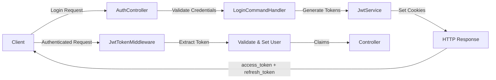

# SampleProject API Documentation

## 📋 Table of Contents
- [Overview](#overview)
- [Architecture](#architecture)
- [Authentication](#authentication)
- [API Endpoints](#api-endpoints)
- [Middleware](#middleware)
- [Logging](#logging)
- [Database](#database)
- [Getting Started](#getting-started)

---

## 🎯 Overview

**SampleProject** is a .NET 9 Web API application implementing Clean Architecture with JWT-based authentication, HTTP-only cookies, and comprehensive logging. The application provides secure user authentication, token management, and audit logging capabilities.

### Key Features
- ✅ JWT authentication with HTTP-only cookies
- ✅ Refresh token management with database persistence
- ✅ Rate limiting with configurable limits
- ✅ Advanced monitoring and metrics collection
- ✅ Correlation ID tracking for requests
- ✅ Audit logging for user changes
- ✅ Request/response logging middleware
- ✅ Global exception handling
- ✅ Health checks with UI dashboard
- ✅ Swagger documentation with demo credentials
- ✅ PostgreSQL database with EF Core
- ✅ Clean Architecture (API, Application, Domain, Infrastructure, Persistence)

---

## 🏗️ Architecture

### Clean Architecture Layers

```
SampleProject/
├── SampleProject (API)              # Presentation layer
├── SampleProject.Application        # Business logic (Commands/Queries via MediatR)
├── SampleProject.Domain             # Domain entities and DTOs
├── SampleProject.Infrastructure     # External services (JWT, Password hashing)
├── SampleProject.Persistence        # Database context and repositories
└── Common.Shared / Common.Options  # Shared libraries
```

### Technology Stack
- **.NET 9** - Web API framework
- **Entity Framework Core** - ORM
- **PostgreSQL** - Database
- **MediatR** - CQRS pattern implementation
- **Serilog** - Structured logging
- **JWT** - Authentication tokens
- **Swagger** - API documentation

---

## 🔐 Authentication

### Authentication Flow



### JWT Token Configuration

- **Access Token**: Short-lived (60 minutes)
- **Refresh Token**: Long-lived (7 days)
- **Storage**: HTTP-only cookies (secure, SameSite=Strict)
- **Cookie Names**: `auth_session` (access), `auth_refresh` (refresh)
- **Token Validation**: Database-backed refresh token validation
- **Security**: Secure flag, SameSite=Strict, HTTP-only

### AuthController Endpoints

#### 1. **POST /api/v1/auth/login** (Anonymous)

Login user and receive JWT tokens in HTTP-only cookies.

**Request:**
```json
{
  "email": "user@example.com",
  "password": "password123"
}
```

**Response:**
```json
{
  "success": true,
  "message": "Login successful",
  "user": {
    "email": "user@example.com",
    "expiresAt": "2025-01-27T15:30:00Z"
  }
}
```

**Cookies Set:**
- `auth_session` - JWT access token (HTTP-only, Secure)
- `auth_refresh` - Refresh token (HTTP-only, Secure)

---

#### 2. **POST /api/v1/auth/logout** (Authorized)

Logout user and revoke refresh token.

**Request:** None (token from cookie)

**Response:**
```json
{
  "success": true,
  "message": "Logout successful"
}
```

**Actions:**
- Clears auth_session and auth_refresh cookies
- Revokes refresh token in database
- Invalidates all sessions for the user

---

#### 3. **POST /api/v1/auth/refresh** (Anonymous)

Refresh access token using refresh token.

**Request:**
```json
{
  "refreshToken": "valid_refresh_token_here"
}
```

**Response:**
```json
{
  "success": true,
  "message": "Token refreshed successfully",
  "expiresAt": "2025-01-27T16:30:00Z"
}
```

**Actions:**
- Validates refresh token from database
- Generates new access and refresh tokens
- Updates cookies
- Increments `RefreshTokenUseCount` in database

---

#### 4. **GET /api/v1/auth/me** (Authorized)

Get current authenticated user information.

**Request:** None (token from cookie)

**Response:**
```json
{
  "success": true,
  "user": {
    "userId": "550e8400-e29b-41d4-a716-446655440000",
    "email": "user@example.com",
    "firstName": "John",
    "lastName": "Doe",
    "fullName": "John Doe",
    "roles": ["User"]
  }
}
```

---

#### 5. **GET /api/v1/auth/validate** (Authorized)

Validate current JWT token.

**Request:** None (token from cookie)

**Response:**
```json
{
  "success": true,
  "message": "Token is valid",
  "user": {
    "userId": "550e8400-e29b-41d4-a716-446655440000",
    "email": "user@example.com"
  }
}
```

---

## 🛣️ API Endpoints

### Authentication Endpoints
```
POST   /api/v1/auth/login           - Login user
POST   /api/v1/auth/logout          - Logout user
POST   /api/v1/auth/refresh         - Refresh access token
GET    /api/v1/auth/me              - Get current user
GET    /api/v1/auth/validate        - Validate token
```

### User Management
```
POST   /api/v1/users                        - Register user (anonymous)
GET    /api/v1/users/{userId}               - Get user by ID (User: self, Admin: any)
GET    /api/v1/users                        - List users (Admin only; filters & pagination)
GET    /api/v1/users/check-email/{email}    - Check email availability (anonymous)

# User endpoints (self-management)
PUT    /api/v1/users/me                     - Update my profile (User only)
PATCH  /api/v1/users/me                     - Partial update my profile (User only)
POST   /api/v1/users/me/change-password     - Change my password (User only)

# Admin endpoints (user management)
PUT    /api/v1/users/{userId}               - Update any user (Admin only)
PATCH  /api/v1/users/{userId}               - Partial update any user (Admin only)
POST   /api/v1/users/{userId}/change-password - Change any user's password (Admin only)
POST   /api/v1/users/{userId}/change-role     - Change user role (Admin only)
```

### Health & Diagnostics
```
GET    /health                      - Health check (env-configured, UI only in Development)
GET    /health-ui                   - Health UI (Development only)
GET    /metrics                     - Prometheus metrics endpoint
```

---

## ⚙️ Configuration (appsettings.json)

### Database Configuration
```json
{
  "Database": {
    "UseInMemory": true,
    "DatabaseName": "SampleProjectDb",
    "ConnectionString": "Host=localhost;Database=SampleProjectDb;Username=postgres;Password=postgres;Port=5432;",
    "EnableSensitiveDataLogging": false
  }
}
```

### JWT Configuration
```json
{
  "Jwt": {
    "SecretKey": "YourSuperSecretKeyThatIsAtLeast32CharactersLong!",
    "Issuer": "SampleProject.API",
    "Audience": "SampleProject.Users",
    "ExpirationMinutes": 60,
    "RefreshTokenExpirationDays": 7,
    "UseCookies": true,
    "AccessTokenCookieName": "auth_session",
    "RefreshTokenCookieName": "auth_refresh",
    "CookieDomain": null,
    "CookiePath": "/",
    "SecureCookies": true,
    "SameSiteMode": "Strict"
  }
}
```

### Swagger Configuration
```json
{
  "Swagger": {
    "Enabled": true,
    "DemoCredentials": {
      "Enabled": true,
      "Users": [
        {
          "Username": "admin@example.com",
          "Password": "admin",
          "Role": "Admin"
        },
        {
          "Username": "user@example.com",
          "Password": "user",
          "Role": "User"
        }
      ]
    },
    "Auth": {
      "Enabled": true,
      "Username": "swagger",
      "Password": "swagger123"
    }
  }
}
```

### Health Check Configuration
```json
{
  "HealthCheck": {
    "Enabled": true,
    "EndpointPath": "/health",
    "UIEndpointPath": "/health-ui",
    "EnableDatabaseHealthCheck": true,
    "EnableMemoryHealthCheck": true
  }
}
```

---

## 🔄 Middleware

### Middleware Pipeline Order

```csharp
1. ExceptionHandlingMiddleware    // Catches all exceptions
2. CORS                          // Handles cross-origin requests
3. SecurityHeadersMiddleware     // Adds security headers
4. HTTPS Redirection            // (Production only)
5. RequestLoggingMiddleware      // Logs all requests/responses
6. MetricsMiddleware             // Collects metrics
7. CorrelationIdMiddleware       // Adds correlation ID tracking
8. RateLimitingMiddleware        // Enforces rate limits
9. Routing                       // Endpoint routing
10. JwtTokenMiddleware           // Extracts JWT from cookies/header
11. Authentication               // Validates JWT
12. Authorization                // Checks permissions
13. Controllers                  // API endpoints
```

### ExceptionHandlingMiddleware

**Purpose:** Global exception handling and consistent error responses.

**Features:**
- Catches all unhandled exceptions
- Maps exceptions to appropriate HTTP status codes
- Returns structured error responses
- Logs errors with context

**Exception Mappings:**
- `BadRequestException` → 400 Bad Request
- `UnauthorizedException` → 401 Unauthorized
- `ForbiddenException` → 403 Forbidden
- `NotFoundException` → 404 Not Found
- `ValidationException` → 400 with validation details
- Other → 500 Internal Server Error

---

### JwtTokenMiddleware

**Purpose:** Extract JWT token from cookies or Authorization header and set HttpContext.User.

**Flow:**
1. Check if endpoint allows anonymous access
2. Extract token from cookies (priority) or Authorization header
3. Validate token and extract claims
4. Create ClaimsIdentity and set HttpContext.User
5. Continue pipeline

**Anonymous Endpoints:**
- `/api/v1/auth/login`
- `/api/v1/auth/refresh`
- `/health`
- `/swagger`

---

### RequestLoggingMiddleware

**Purpose:** Log all HTTP requests and responses with detailed information.

**Logged Information:**
- Request ID (unique per request)
- HTTP method and path
- Query string parameters
- Client IP address
- User agent
- Request/response headers
- Request body (for POST/PUT/PATCH)
- Response status code
- Response time (in milliseconds)
- Error response body (for status >= 400)

**Example Log:**
```
[INF] Request abc123: POST /api/v1/auth/login from 127.0.0.1 - UserAgent: Mozilla/5.0
[INF] Response abc123: 200 in 152ms - ContentLength: 256
```

---

## 🔧 Installers and Services

### Installer Order and Configuration

The application uses a modular installer pattern for service configuration:

```csharp
1. LoggingInstaller (Order: 6)      // Serilog configuration
2. JwtInstaller (Order: 8)          // JWT authentication
3. HealthCheckInstaller (Order: 8)  // Health checks
4. SwaggerInstaller (Order: 9)      // API documentation
5. PrometheusInstaller (Order: 10)  // Metrics collection
```

### Available Installers

- **ApplicationServiceInstaller**: MediatR, AutoMapper, FluentValidation
- **DatabaseInstaller**: Entity Framework, connection strings, retry policies
- **InfrastructureServiceInstaller**: JWT service, Password service, Cache service
- **PersistenceServiceInstaller**: Repository pattern, Unit of Work
- **LoggingInstaller**: Serilog configuration, file/console logging
- **JwtInstaller**: JWT authentication, authorization policies
- **HealthCheckInstaller**: Health checks, database/memory monitoring
- **SwaggerInstaller**: API documentation, demo credentials
- **PrometheusInstaller**: Metrics collection, HTTP request monitoring

---

## 📊 Monitoring and Metrics

### Prometheus Metrics

The application includes comprehensive monitoring:

- **HTTP Request Metrics**: Request count, duration, status codes
- **Custom Business Metrics**: User actions, authentication events
- **System Metrics**: Memory usage, database connections
- **Endpoint**: `/metrics` - Prometheus metrics endpoint

### Health Checks

- **Endpoint**: `/health` - Basic health status
- **UI**: `/health-ui` - Visual health dashboard (Development only)
- **Checks**: Database connectivity, memory usage, basic application health

### Logging and Observability

- **Structured Logging**: JSON format with correlation IDs
- **Request Tracing**: Unique request IDs for tracking
- **Performance Metrics**: Response time tracking
- **Error Tracking**: Comprehensive error logging with context

---

## 🚦 Rate Limiting

### Rate Limiting Configuration

The application includes comprehensive rate limiting to prevent abuse:

```json
{
  "RateLimiting": {
    "Enabled": true,
    "GlobalRateLimit": 1000,
    "PerIpRateLimit": 100,
    "AuthRateLimit": 10,
    "RefreshTokenRateLimit": 5,
    "WindowInMinutes": 1,
    "EnableEndpointRateLimiting": true,
    "EnableRateLimitHeaders": true
  }
}
```

### Rate Limits
- **Global**: 1000 requests per minute
- **Per IP**: 100 requests per minute  
- **Authentication**: 10 requests per minute
- **Refresh Token**: 5 requests per minute

### Rate Limit Headers
```
X-RateLimit-Limit-Global: 1000
X-RateLimit-Remaining-Global: 999
X-RateLimit-Limit-IP: 100
X-RateLimit-Remaining-IP: 99
X-RateLimit-Reset: Mon, 27 Jan 2025 15:30:00 GMT
```

---

## 🔍 Advanced Monitoring

### Monitoring Configuration

```json
{
  "Monitoring": {
    "Enabled": true,
    "EnableBusinessMetrics": true,
    "EnablePerformanceMetrics": true,
    "EnableCustomMetrics": true,
    "CollectionIntervalSeconds": 30,
    "EnableCorrelationId": true,
    "CorrelationIdHeaderName": "X-Correlation-ID",
    "EnableDatabaseMonitoring": true,
    "EnableMemoryMonitoring": true,
    "EnableCpuMonitoring": true,
    "EnableBusinessEventTracking": true
  }
}
```

### Available Metrics
- **HTTP Requests**: Count, duration, status codes
- **Authentication Events**: Login, logout, refresh attempts
- **Business Events**: User creation, updates, deletions
- **System Metrics**: Memory usage, CPU usage, GC collections
- **Database Queries**: Query duration, success/failure rates

### Correlation ID
All requests include a correlation ID for tracking:
- **Header**: `X-Correlation-ID`
- **Format**: 8-character alphanumeric string
- **Purpose**: Request tracing and debugging

---

## 📝 Logging

### Logging Configuration

**Serilog** is configured with structured logging in two environments:

#### Development (`appsettings.Development.json`)
```json
{
  "Serilog": {
    "MinimumLevel": {
      "Default": "Information",
      "Override": {
        "Microsoft": "Warning",
        "System": "Warning"
      }
    },
    "WriteTo": [
      {
        "Name": "Console",
        "Args": {
          "outputTemplate": "[{Timestamp:HH:mm:ss} {Level:u3}] {Message:lj}{NewLine}{Exception}"
        }
      },
      {
        "Name": "File",
        "Args": {
          "path": "Logs/application-.log",
          "rollingInterval": "Day",
          "retainedFileCountLimit": 30
        }
      }
    ]
  }
}
```

#### Production (`appsettings.Production.json`)
```json
{
  "Serilog": {
    "MinimumLevel": {
      "Default": "Error"
    }
  }
}
```

### Log Files

- `Logs/application-YYYYMMDD.log` - General application logs
- `Logs/detailed-YYYYMMDD.log` - Detailed request/response logs

### Log Levels

- **Information**: Normal application flow, successful operations
- **Warning**: Unusual but recoverable situations
- **Error**: Errors that don't stop the application
- **Fatal**: Critical errors that cause application shutdown

---

## 🗄️ Database

### Entity Framework Core

**Context:** `ApplicationDbContext`

### Tables

#### **Users**
```csharp
- Id (Guid, PK)
- Email (string, unique)
- FirstName (string)
- LastName (string)
- PasswordHash (string)
- PasswordSalt (string)
- Roles (UserRole enum)
- IsActive (bool)
- IsEmailVerified (bool)
- CreatedAt (DateTime)
- LastLoginAt (DateTime?)
- RefreshToken (string?)
- RefreshTokenExpiryTime (DateTime?)
- RefreshTokenUseCount (int, default: 0)
- RefreshTokenLastUsedAt (DateTime?)
```

#### **UserAuditLogs**
```csharp
- Id (Guid, PK)
- UserId (Guid, FK)
- Action (string) // Created, Updated, Deleted
- FieldName (string?)
- OldValue (string?)
- NewValue (string?)
- ChangedByUserId (Guid?)
- IpAddress (string?)
- UserAgent (string?)
- CreatedAt (DateTime)
- Notes (string?)
```

### Database Triggers

Automatic audit logging on Users table:

```sql
-- Trigger fires on INSERT, UPDATE, DELETE
CREATE TRIGGER user_audit_trigger
AFTER INSERT OR UPDATE OR DELETE ON "Users"
FOR EACH ROW EXECUTE FUNCTION log_user_changes();
```

**Trigger Actions:**
- **INSERT**: Logs user creation with full details
- **UPDATE**: Logs changes with old and new values (only if data changed)
- **DELETE**: Logs user deletion

---

## 🚀 Getting Started

### Prerequisites
- .NET 9 SDK
- PostgreSQL 12+
- Docker (optional, for running PostgreSQL)

### Setup

1. **Clone the repository**
```bash
git clone <repository-url>
cd SampleProject
```

2. **Configure database connection**
```json
// appsettings.Development.json
{
  "ConnectionStrings": {
    "DefaultConnection": "Host=localhost;Port=5432;Database=sampledb;Username=postgres;Password=yourpassword"
  }
}
```

3. **Run database migrations**
```bash
dotnet ef database update --project SampleProject.Persistence
```

4. **Run the application (local)**
```bash
cd SampleProject
dotnet run
```

5. **Docker (optional)**
```bash
docker compose up -d --build
# API: http://localhost:15553
# Swagger: http://localhost:15553/swagger
# Health: http://localhost:15553/health
# Metrics: http://localhost:15553/metrics
```

6. **Access the application**
- API: `http://localhost:15553` (HTTP) or `https://localhost:7155` (HTTPS)
- Swagger: `http://localhost:15553/swagger` (Development only)
- Health UI: `http://localhost:15553/health-ui` (Development only)

---

## 📚 Additional Documentation

- [API Documentation](API_DOCUMENTATION.md) - Complete API reference with examples
- [Comprehensive Functionality Analysis](COMPREHENSIVE_FUNCTIONALITY_ANALYSIS.md) - Detailed feature analysis
- [Architecture Analysis](ARCHITECTURE_ANALYSIS.md) - Detailed architecture overview
- [JWT Cookies Implementation](JWT_COOKIES_IMPLEMENTATION.md) - JWT authentication details
- [Audit Log and Token History](AUDIT_LOG_AND_TOKEN_HISTORY.md) - Audit logging implementation
- [Database Migrations](SampleProject.Persistence/Migrations/README.md) - Database migration guide

---

## 🔒 Security Features

- ✅ JWT tokens in HTTP-only cookies (prevents XSS)
- ✅ Secure flag on cookies (HTTPS only)
- ✅ SameSite=Strict (prevents CSRF)
- ✅ Refresh tokens stored in database
- ✅ Automatic refresh token revocation on logout
- ✅ Password hashing with salt (PBKDF2)
- ✅ Rate limiting with configurable limits
- ✅ Correlation ID tracking for security monitoring
- ✅ Global exception handling
- ✅ Request/response logging
- ✅ Security headers middleware
- ✅ Audit logging for user changes
- ✅ CORS configuration
- ✅ Advanced monitoring and metrics

---

## 📧 Contact

For questions or issues, please create an issue in the repository.

---

**SampleProject** - Clean Architecture .NET 9 Web API with JWT Authentication
